## calc

### Let's check

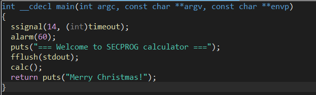

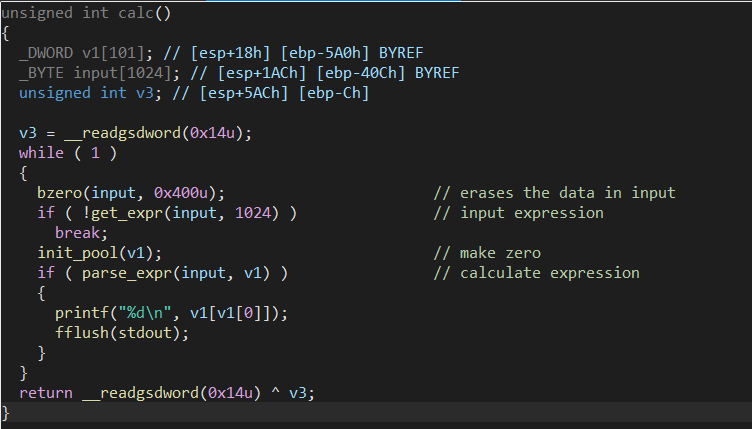

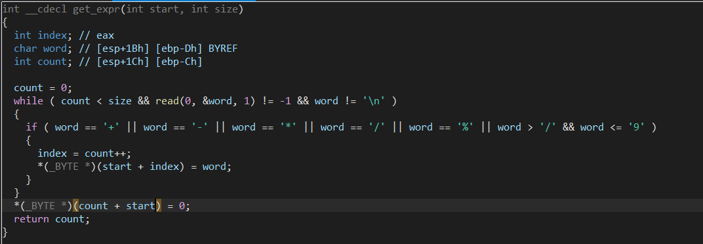
- Check if the expression valid.

There is nothing important in the above section; I will check the details in parse_expr.

```c
int __cdecl parse_expr(int input, _DWORD *arr)
{
  int v3; // eax
  int v4; // [esp+20h] [ebp-88h]
  int i; // [esp+24h] [ebp-84h]
  int v6; // [esp+28h] [ebp-80h]
  int lenNum; // [esp+2Ch] [ebp-7Ch]
  char *num; // [esp+30h] [ebp-78h]
  int v9; // [esp+34h] [ebp-74h]
  _BYTE expression[100]; // [esp+38h] [ebp-70h] BYREF
  unsigned int v11; // [esp+9Ch] [ebp-Ch]

  v11 = __readgsdword(0x14u);
  v4 = input;
  v6 = 0;
  bzero(expression, 0x64u);                     // erases
  for ( i = 0; ; ++i )
  {
    if ( *(char *)(i + input) - (unsigned int)'0' > 9 )// check in [+, -, *, /, %] or null byte \(￣︶￣*\))
    {
      lenNum = i + input - v4;
      num = (char *)malloc(lenNum + 1);
      memcpy(num, v4, lenNum);
      num[lenNum] = 0;
      if ( !strcmp(num, "0") )
      {
        puts("prevent division by zero");
        fflush(stdout);
        return 0;
      }
      v9 = atoi(num);
      if ( v9 > 0 )
      {
        v3 = (*arr)++;
        arr[v3 + 1] = v9;
      }
      if ( *(_BYTE *)(i + input) && *(char *)(i + 1 + input) - (unsigned int)'0' > 9 )// 
                                                // check if current index is not null and next index is not the num
                                                // if current index is null, continue
      {
        puts("expression error!");
        fflush(stdout);
        return 0;
      }
      v4 = i + 1 + input;                       // next num
      if ( expression[v6] )
      {
        switch ( *(_BYTE *)(i + input) )
        {
          case '%':
          case '*':
          case '/':
            if ( expression[v6] != '+' && expression[v6] != '-' )// check in [%, *, /] -> calculate immediately
              goto LABEL_14;
            expression[++v6] = *(_BYTE *)(i + input);
            break;
          case '+':
          case '-':
LABEL_14:
            eval(arr, expression[v6]);          // calculate the right first and replace with new sign
            expression[v6] = *(_BYTE *)(i + input);
            break;
          default:                              // it checks byte "\n" ~ mean end of input
            eval(arr, expression[v6--]);        // calculate the right first and remove this sign
            break;
        }
      }
      else
      {
        expression[v6] = *(_BYTE *)(i + input);
      }
      if ( !*(_BYTE *)(i + input) )
        break;
    }
  }
  while ( v6 >= 0 )
    eval(arr, expression[v6--]);
  return 1;
}
```

I comment in detail in some important code, so I just summarize the main note.

1. This function checks each char in input until this char is in [+, -, *, /, %] or a null byte. Why NULL byte?? 

The reason for this is that `- (unsigned int)'0'`
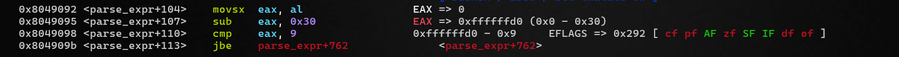 

2. If matched, it calls malloc and atoi to convert to a number. Especially, this saves the number of num to *arr and each num after this,arr while arr is v1[101] in the calc function.

- I imagine that v1[0] saves the number of num, and v1[1], v1[2],.... save each number after.

3. In the first expression, this function doesn't call anything; it just saves the first size to expression[].

4. The next work is the same as the above-mentioned steps, but now this will calculate

```c
      if ( expression[v6] )
      {
        switch ( *(_BYTE *)(i + input) )
        {
          case '%':
          case '*':
          case '/':
            if ( expression[v6] != '+' && expression[v6] != '-' )// check in [%, *, /] -> calculate immediately
              goto LABEL_14;
            expression[++v6] = *(_BYTE *)(i + input);
            break;
          case '+':
          case '-':
LABEL_14:
            eval(arr, expression[v6]);          // calculate the right first and replace with new sign
            expression[v6] = *(_BYTE *)(i + input);
            break;
          default:                              // it checks byte "\n" ~ mean end of input
            eval(arr, expression[v6--]);        // calculate the right first and remove this sign
            break;
        }
      }
```

<p align="center">
  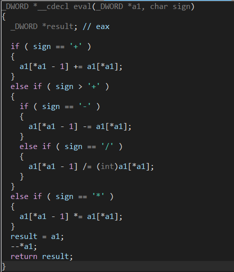
</p>

***eval***  only calculate two number `a1[*a1 - 1]` and `a1[*a1]` and give the result in the first number. After that, this will decrease `*a1 ~ the number of num` to get the index of the result and calculate later expression.

- This rule is that calculate [*, /, %] before [+, -]. This section implement by locating the sign with higher role in the right of expression.
- If sign in [*, /, %], and the previous also in this, this will calculate the previous first because of the same role. Meanwhile, if sign in [\*, /, %] and the previous in [+, -], this only add this sign to the right of expression.
- If sign in [+, -], it will calculate the right most of expression and replace the old sign.

***Example***

1+2\*3+4
&rarr;1
&rarr;1+2\*3
&rarr;1+6+4

1+2\*3\*4+5
&rarr;1+2\*3
&rarr;1+6\*4
&rarr;1+24+5

1\*2+3+4\*5
&rarr;1\*2
&rarr;2+3
&rarr;5+4\*5

1\*2+3+4\*5+6
&rarr;1\*2
&rarr;2+3
&rarr;5+4\*5
&rarr;5+20+6

Once done, this section will calculate from the right to the left of the expression; this would be right because the sign in the later expression is only in [+, -] or the sign with the higher role in the rightmost

```c
while ( v6 >= 0 )
    eval(arr, expression[v6--]);
```

### Exploitation

Hmm, do I miss something?

- I just think that this should only handle (check in loop) with sign instead of both sign and number.

- If it gets two numbers in v1 to calculate, is it possible to input only one number and trigger something?

- Is this use of v1[0] as a count and taking it as the index to calculate while num is just in the next location secure?

If I don't input any number before signing in the first expression.

```c
if ( sign == '+' )
{
    a1[*a1 - 1] += a1[*a1];
}
```

```c
if ( parse_expr(input, v1) )                // calculate expression
{
    printf("%d\n", v1[v1[0]]);
    fflush(stdout);
}
```

#### AAR

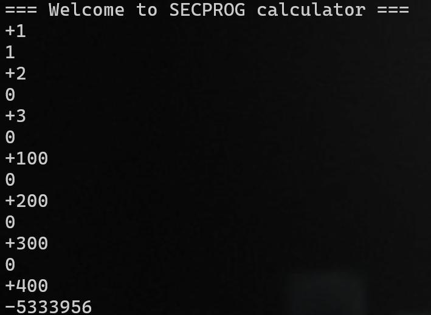

`-5333956 ~ 0xffae9c3c`

count = 1 

&rarr; a1[count - 1] += a1[count] ***(a1[0] ~ count ; a1[1] = 400)***

&rarr; a1[0] = 1 + a1[1] = 1 + 400 = 401

&rarr; count = 401

#### AAW

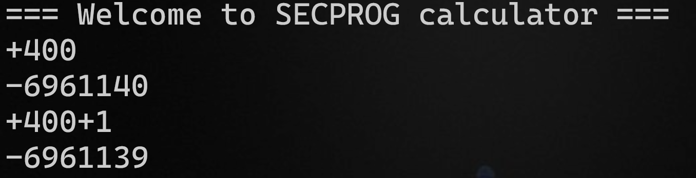


count = 1 

&rarr; a1[count - 1] += a1[count] ***(a1[0] ~ count ; a1[1] = 400)***

&rarr; a1[0] = 1 + a1[1] = 1 + 400 = 401

&rarr; count = 401

&rarr; a1[count - 1] += a1[count] ***(a1[0] ~ count ; a1[1] = 400)***

&rarr; a1[400] += a1[401] 

a1[401] = 1, the reason for this is that
```c
if ( v9 > 0 )
{
    v3 = (*arr)++;
    arr[v3 + 1] = v9;
}
```
#### Note

The other sign has the same logic bug, so I just use it to leak, write the payload, and execute this.

### Payload

[***solve.py***](https://github.com/BabyBroder/CTF/blob/pwnableTW/calc/solve.py)

## Secrect Garden
### Let's check

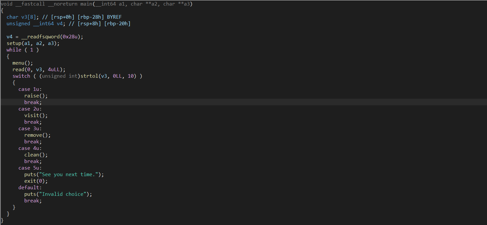

#### raise

```c
int raise()
{
  _QWORD *v0; // rbx
  void *v1; // rbp
  _QWORD *v2; // rcx
  unsigned int v3; // edx
  _DWORD size[9]; // [rsp+4h] [rbp-24h] BYREF

  *(_QWORD *)&size[1] = __readfsqword(0x28u);
  size[0] = 0;
  if ( count_flower > 0x63u )
    return puts("The garden is overflow");
  v0 = malloc(0x28uLL);
  *v0 = 0LL;
  v0[1] = 0LL;                                  // name
  v0[2] = 0LL;                                  // color
  v0[3] = 0LL;
  v0[4] = 0LL;
  __printf_chk(1LL, "Length of the name :");
  if ( (unsigned int)__isoc99_scanf("%u", size) == -1 )
    exit(-1);
  v1 = malloc(size[0]);
  if ( !v1 )
  {
    puts("Alloca error !!");
    exit(-1);
  }
  __printf_chk(1LL, "The name of flower :");
  read(0, v1, size[0]);
  v0[1] = v1;
  __printf_chk(1LL, "The color of the flower :");
  __isoc99_scanf("%23s", v0 + 2);
  *(_DWORD *)v0 = 1;                            // mark it grow
  if ( garden[0] )
  {
    v2 = &garden[1];
    v3 = 1;
    while ( *v2 )
    {
      ++v3;
      ++v2;
      if ( v3 == 100 )
        goto Add;
    }
  }
  else
  {
    v3 = 0;
  }
  garden[v3] = v0;
Add:
  ++count_flower;
  return puts("Successful !");
}
```

- raise() use malloc to **allocate for v0 with the size of 0x28**, make sure all element in v0 is zero.
- Then, malloc to allocate for v1 with the size which I input, I will enter the name of flower with the respectively size. -> **v0[1] = v1** -> **v0[1] is the pointer to v1.**
- Afterwards, raise() requires to input the color of the flower with the size: 23(make sure < 3 bytes), and store in v0[2], and ->`*(_DWORD *)v0 = 1`;
- Finally, it **stores v0 to garden** **make sure the size of garden <= 100**

**I think about the struct like this**

```cpp=
struct Flower{
    int used;                // set when raise successfully
    char *name_flower;       // input the size and input the name
    char color_flower[24];   // nothing special, except for the input 
}
```

***Then, the program will store a pointer to this struct in garden.***

#### visit

```c
int visit()
{
  __int64 v0; // rbx
  __int64 v1; // rax

  v0 = 0LL;
  if ( count_flower )
  {
    do
    {
      v1 = garden[v0];
      if ( v1 && *(_DWORD *)v1 )
      {
        __printf_chk(1LL, "Name of the flower[%u] :%s\n", v0, *(const char **)(v1 + 8));
        LODWORD(v1) = __printf_chk(1LL, "Color of the flower[%u] :%s\n", v0, (const char *)(garden[v0] + 16LL));
      }
      ++v0;
    }
    while ( v0 != 100 );
  }
  else
  {
    LODWORD(v1) = puts("No flower in the garden !");
  }
  return v1;
}
```

It is simple to print all the flowers in the garden with the condition that  `v1 && *(_DWORD *)v1`, which also means v1 is the valid pointer (not null) and used in struct flower is set.

#### remove

```c
int remove()
{
  _DWORD *v1; // rax
  unsigned int index; // [rsp+4h] [rbp-14h] BYREF
  unsigned __int64 v3; // [rsp+8h] [rbp-10h]

  v3 = __readfsqword(0x28u);
  if ( !count_flower )
    return puts("No flower in the garden");
  __printf_chk(1LL, "Which flower do you want to remove from the garden:");
  __isoc99_scanf("%d", &index);
  if ( index <= 0x63 && (v1 = (_DWORD *)garden[index]) != 0LL )
  {
    *v1 = 0;                                    // mark Flower = 0, but this function doesn't check it
    free(*(void **)(garden[index] + 8LL));      // don't free Flower, only free name of Flower
    return puts("Successful");
  }
  else
  {
    puts("Invalid choice");
    return 0;
  }
}
```
This function takes input(index) from user and check `index <= 0x63 && (v1 = (_DWORD *)garden[index]) != 0LL `, then free this pointer to flower.

#### clean

```c
unsigned __int64 clean()
{
  _QWORD *v0; // rbx
  _DWORD *v1; // rdi
  unsigned __int64 v3; // [rsp+8h] [rbp-20h]

  v3 = __readfsqword(0x28u);
  v0 = garden;
  do
  {
    v1 = (_DWORD *)*v0;
    if ( *v0 && !*v1 )
    {
      free(v1);                                 // Also free Flower
      *v0 = 0LL;
      --count_flower;
    }
    ++v0;
  }
  while ( v0 != &garden[100] );
  puts("Done!");
  return __readfsqword(0x28u) ^ v3;
}
```
***Loop all flower in the garden(from 0 to 100), check condition: `*v0 && !*v1 `***

#### exit

***leave the program***

### Exploitation

```c
if ( index <= 0x63 && (v1 = (_DWORD *)garden[index]) != 0LL )
{
    *v1 = 0;                                    // mark Flower = 0, but this function doesn't check it
    free(*(void **)(garden[index] + 8LL));      // don't free Flower, only free name of Flower
    return puts("Successful");
}
```

***free:*** **not** set **ptr to null** and check **used to 0**. -> **double free** -> **arbitrary write primitives**

***And free THE CHUNK STORE THE NAME OF THE FLOWER, NOT THE FLOWER.***

#### Leak libc

**Notice that:** in the raise() function, the program will malloc 0x28 (the chunk will have a size of 0x30) and I have one more time to request malloc with the size I input(for name of the flower).
**Target:** *unsortedbin* + *remainder*.
**Example**
- I request 0x100 size for name (0x110 size for chunk) twice; the second is to ensure that the chunk will not consolidate with the top chunk.
- Then, free the first chunk
- Request 0xd8 size for name(0xe0 size for chunk)
    - **The reason**: 0x30 + 0xe0 = 0x110
    - First, the unsorted will take 0x30 in unsortedbin to request for the struct flower, and the request for the name in the second (0xe0) will allocate for the remain chunk. 
    - Write the name with length 8 to leak the address of unsortedbin when call printf()
#### The result

**Before free**
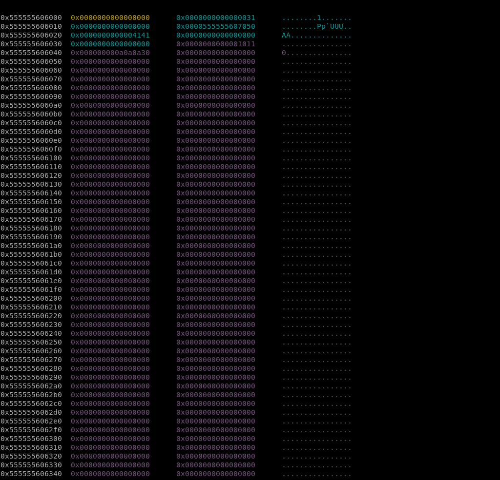
- I don't know exactly what the chunk with size of 0x1011 is, but it is not important, so I will pass it.  

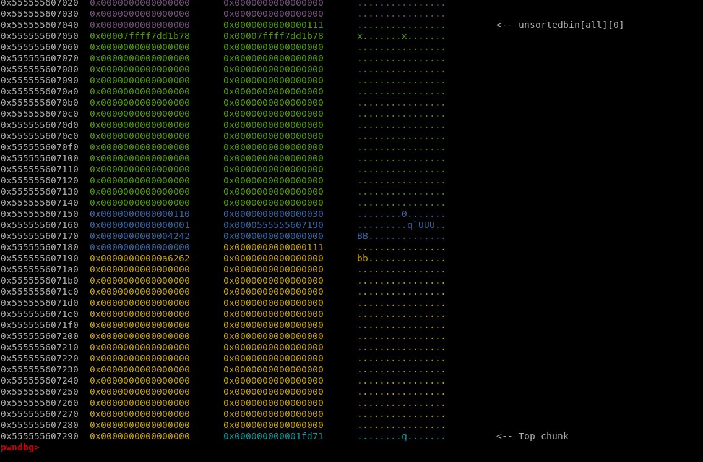

**After request to trigger**

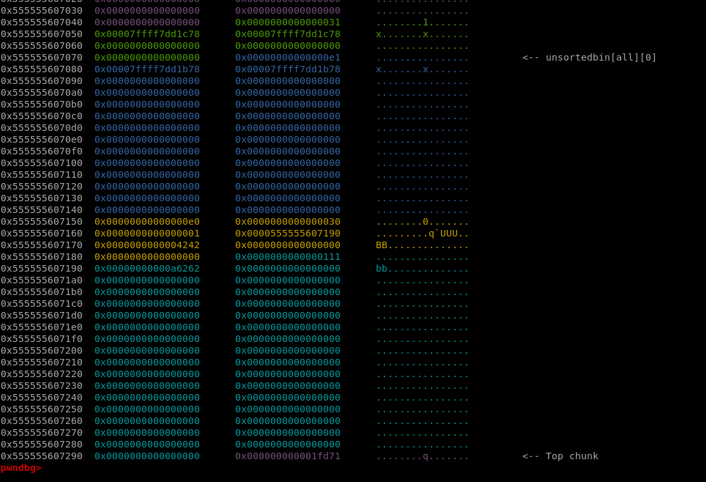


- The first request for the struct flower.

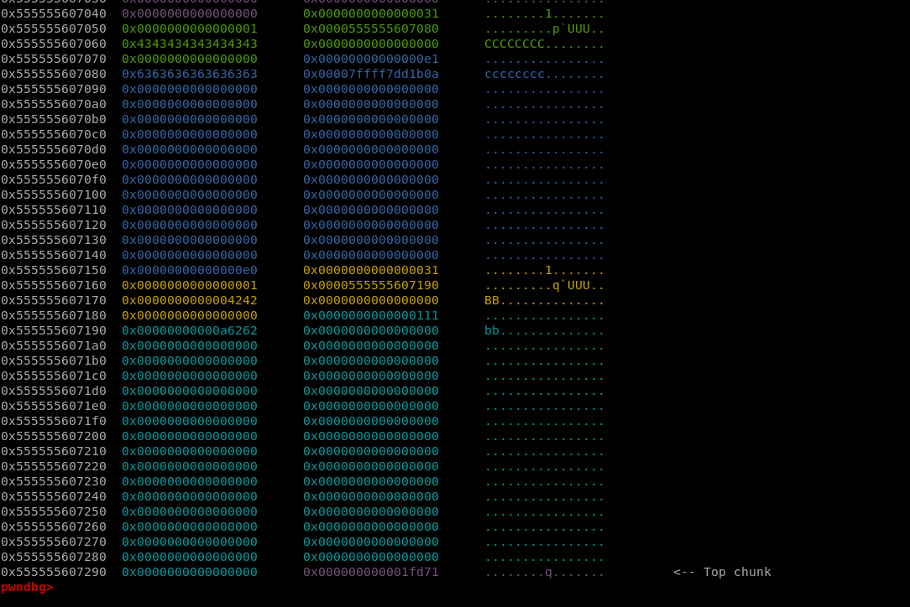

- Next, request for the name of the flower.

- The next time I call visit(), it will leak the address of unsortedbin->leaklibc.

- Fastbin dup to trigger call system("/bin/sh"): onegadget.

- First, I try to overwrite the malloc_hook with **one gadet**. Unless it fails, I will find other ways. Fortunately, it works. 

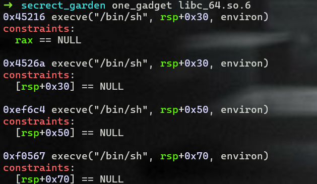

### Payload

[***solve.py***](https://github.com/BabyBroder/CTF/blob/pwnableTW/secrect_garden/solve.py)