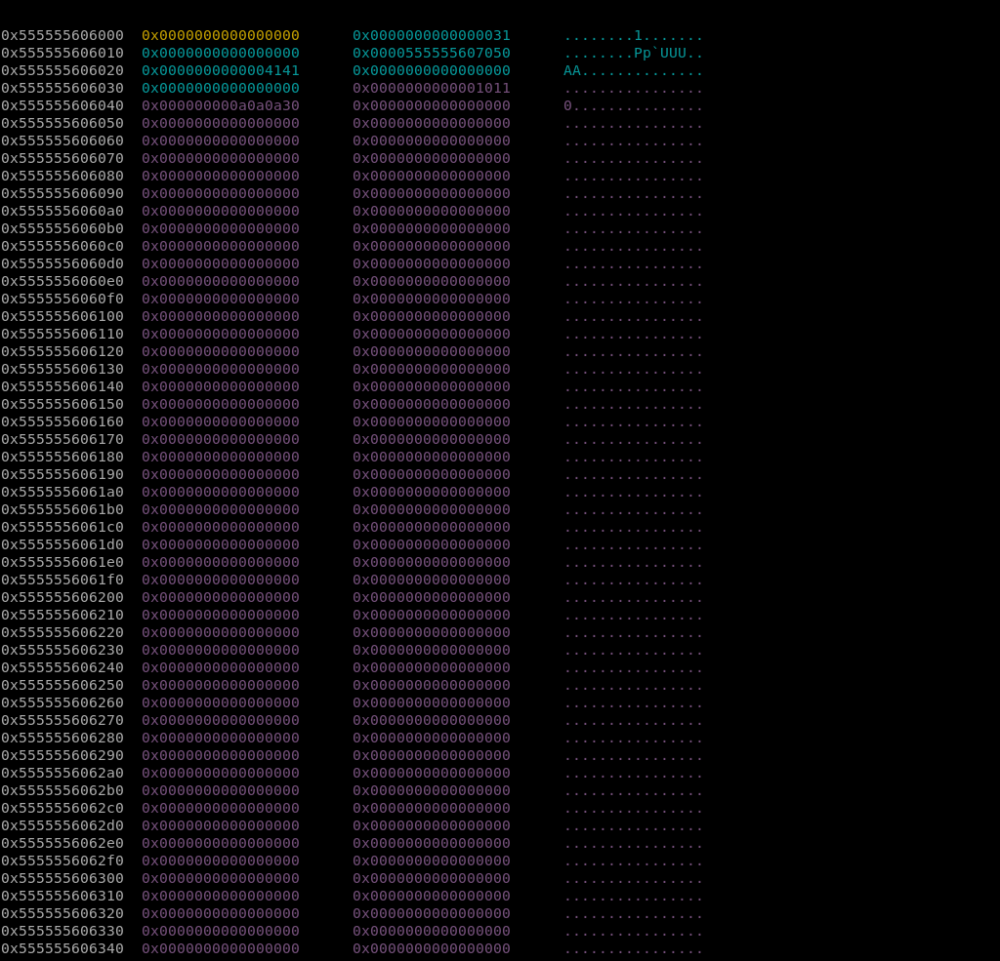
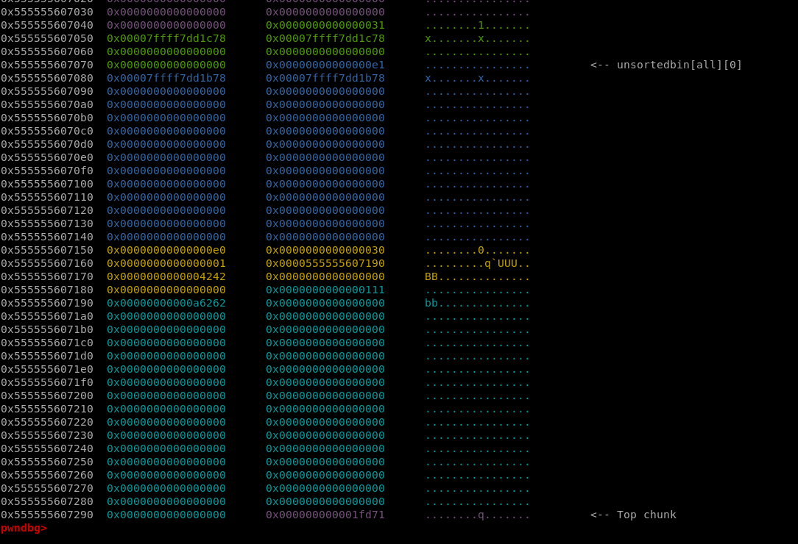
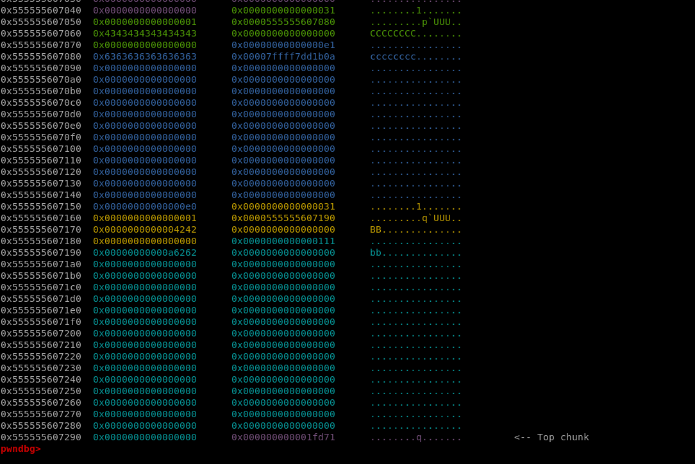

## Secrect Garden
### Let's check


#### raise

```c
int raise()
{
  _QWORD *v0; // rbx
  void *v1; // rbp
  _QWORD *v2; // rcx
  unsigned int v3; // edx
  _DWORD size[9]; // [rsp+4h] [rbp-24h] BYREF

  *(_QWORD *)&size[1] = __readfsqword(0x28u);
  size[0] = 0;
  if ( count_flower > 0x63u )
    return puts("The garden is overflow");
  v0 = malloc(0x28uLL);
  *v0 = 0LL;
  v0[1] = 0LL;                                  // name
  v0[2] = 0LL;                                  // color
  v0[3] = 0LL;
  v0[4] = 0LL;
  __printf_chk(1LL, "Length of the name :");
  if ( (unsigned int)__isoc99_scanf("%u", size) == -1 )
    exit(-1);
  v1 = malloc(size[0]);
  if ( !v1 )
  {
    puts("Alloca error !!");
    exit(-1);
  }
  __printf_chk(1LL, "The name of flower :");
  read(0, v1, size[0]);
  v0[1] = v1;
  __printf_chk(1LL, "The color of the flower :");
  __isoc99_scanf("%23s", v0 + 2);
  *(_DWORD *)v0 = 1;                            // mark it grow
  if ( garden[0] )
  {
    v2 = &garden[1];
    v3 = 1;
    while ( *v2 )
    {
      ++v3;
      ++v2;
      if ( v3 == 100 )
        goto Add;
    }
  }
  else
  {
    v3 = 0;
  }
  garden[v3] = v0;
Add:
  ++count_flower;
  return puts("Successful !");
}
```

- raise() use malloc to **allocate for v0 with the size of 0x28**, make sure all element in v0 is zero.
- Then, malloc to allocate for v1 with the size which I input, I will enter the name of flower with the respectively size. -> **v0[1] = v1** -> **v0[1] is the pointer to v1.**
- Afterwards, raise() requires to input the color of the flower with the size: 23(make sure < 3 bytes), and store in v0[2], and ->`*(_DWORD *)v0 = 1`;
- Finally, it **stores v0 to garden** **make sure the size of garden <= 100**

**I think about the struct like this**

```cpp=
struct Flower{
    int used;                // set when raise successfully
    char *name_flower;       // input the size and input the name
    char color_flower[24];   // nothing special, except for the input 
}
```

***Then, the program will store a pointer to this struct in garden.***

#### visit

```c
int visit()
{
  __int64 v0; // rbx
  __int64 v1; // rax

  v0 = 0LL;
  if ( count_flower )
  {
    do
    {
      v1 = garden[v0];
      if ( v1 && *(_DWORD *)v1 )
      {
        __printf_chk(1LL, "Name of the flower[%u] :%s\n", v0, *(const char **)(v1 + 8));
        LODWORD(v1) = __printf_chk(1LL, "Color of the flower[%u] :%s\n", v0, (const char *)(garden[v0] + 16LL));
      }
      ++v0;
    }
    while ( v0 != 100 );
  }
  else
  {
    LODWORD(v1) = puts("No flower in the garden !");
  }
  return v1;
}
```

It is simple to print all the flowers in the garden with the condition that  `v1 && *(_DWORD *)v1`, which also means v1 is the valid pointer (not null) and used in struct flower is set.

#### remove

```c
int remove()
{
  _DWORD *v1; // rax
  unsigned int index; // [rsp+4h] [rbp-14h] BYREF
  unsigned __int64 v3; // [rsp+8h] [rbp-10h]

  v3 = __readfsqword(0x28u);
  if ( !count_flower )
    return puts("No flower in the garden");
  __printf_chk(1LL, "Which flower do you want to remove from the garden:");
  __isoc99_scanf("%d", &index);
  if ( index <= 0x63 && (v1 = (_DWORD *)garden[index]) != 0LL )
  {
    *v1 = 0;                                    // mark Flower = 0, but this function doesn't check it
    free(*(void **)(garden[index] + 8LL));      // don't free Flower, only free name of Flower
    return puts("Successful");
  }
  else
  {
    puts("Invalid choice");
    return 0;
  }
}
```
This function takes input(index) from user and check `index <= 0x63 && (v1 = (_DWORD *)garden[index]) != 0LL `, then free this pointer to flower.

#### clean

```c
unsigned __int64 clean()
{
  _QWORD *v0; // rbx
  _DWORD *v1; // rdi
  unsigned __int64 v3; // [rsp+8h] [rbp-20h]

  v3 = __readfsqword(0x28u);
  v0 = garden;
  do
  {
    v1 = (_DWORD *)*v0;
    if ( *v0 && !*v1 )
    {
      free(v1);                                 // Also free Flower
      *v0 = 0LL;
      --count_flower;
    }
    ++v0;
  }
  while ( v0 != &garden[100] );
  puts("Done!");
  return __readfsqword(0x28u) ^ v3;
}
```
***Loop all flower in the garden(from 0 to 100), check condition: `*v0 && !*v1 `***

#### exit

***leave the program***

### Exploitation

```c
if ( index <= 0x63 && (v1 = (_DWORD *)garden[index]) != 0LL )
{
    *v1 = 0;                                    // mark Flower = 0, but this function doesn't check it
    free(*(void **)(garden[index] + 8LL));      // don't free Flower, only free name of Flower
    return puts("Successful");
}
```

***free:*** **not** set **ptr to null** and check **used to 0**. -> **double free** -> **arbitrary write primitives**

***And free THE CHUNK STORE THE NAME OF THE FLOWER, NOT THE FLOWER.***

#### Leak libc

**Notice that:** in the raise() function, the program will malloc 0x28 (the chunk will have a size of 0x30) and I have one more time to request malloc with the size I input(for name of the flower).
**Target:** *unsortedbin* + *remainder*.
**Example**
- I request 0x100 size for name (0x110 size for chunk) twice; the second is to ensure that the chunk will not consolidate with the top chunk.
- Then, free the first chunk
- Request 0xd8 size for name(0xe0 size for chunk)
    - **The reason**: 0x30 + 0xe0 = 0x110
    - First, the unsorted will take 0x30 in unsortedbin to request for the struct flower, and the request for the name in the second (0xe0) will allocate for the remain chunk. 
    - Write the name with length 8 to leak the address of unsortedbin when call printf()
#### The result

**Before free**

- I don't know exactly what the chunk with size of 0x1011 is, but it is not important, so I will pass it.  


**After request to trigger**




- The first request for the struct flower.



- Next, request for the name of the flower.

- The next time I call visit(), it will leak the address of unsortedbin->leaklibc.

- Fastbin dup to trigger call system("/bin/sh"): onegadget.

- First, I try to overwrite the malloc_hook with **one gadet**. Unless it fails, I will find other ways. Fortunately, it works. 


### Payload

[solve.py](https://github.com/BabyBroder/CTF/blob/pwnableTW/secrect_garden/solve.py)