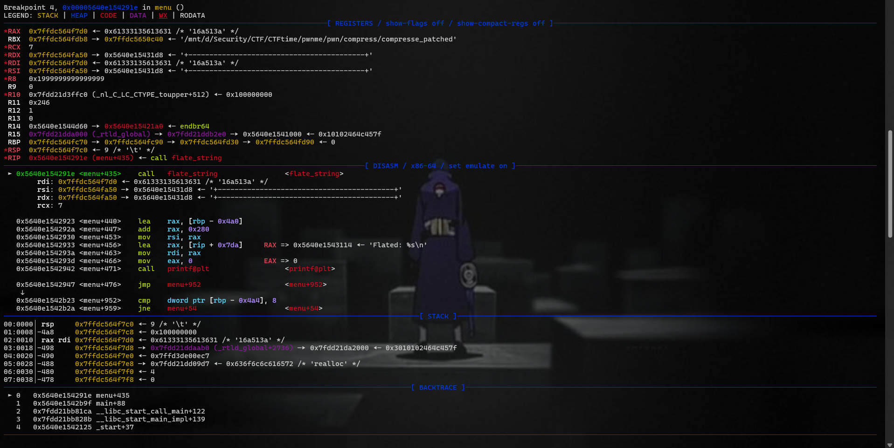
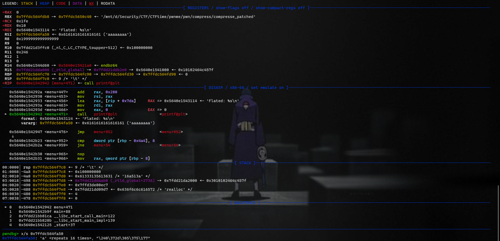
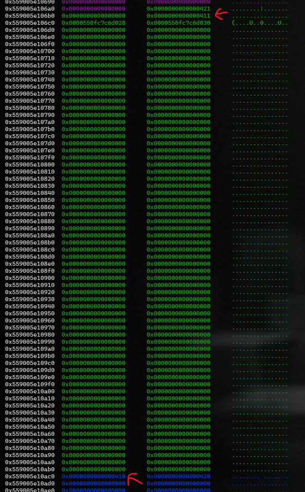
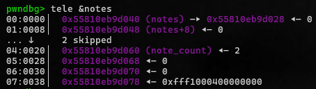

## Wrap arround

```c
unsigned __int64 menu()
{
  unsigned int v1; // [rsp+8h] [rbp-4A8h]
  int v2; // [rsp+Ch] [rbp-4A4h]
  char str[128]; // [rsp+10h] [rbp-4A0h] BYREF
  char v4[512]; // [rsp+90h] [rbp-420h] BYREF
  char v5[512]; // [rsp+290h] [rbp-220h] BYREF
  __int64 v6; // [rsp+490h] [rbp-20h]
  char buf[10]; // [rsp+49Eh] [rbp-12h] BYREF
  unsigned __int64 v8; // [rsp+4A8h] [rbp-8h]

  v8 = __readfsqword(0x28u);
  v1 = 0;
  v6 = 0LL;
  do
  {
    puts("\nMenu:");
    puts("1. Flate");
    puts("2. Deflate");
    puts("3. New note");
    puts("4. Edit note");
    puts("5. Delete note");
    puts("6. View note");
    puts("7. Select note");
    puts("8. Exit");
    printf("Enter your choice: ");
    fflush(_bss_start);
    read(0, buf, 0xAuLL);
    v2 = atoi(buf);
    switch ( v2 )
    {
      case 1:
        printf("Enter a string to flate: ");
        fflush(_bss_start);
        read(0, str, 0x80uLL);
        str[strcspn(str, "\n")] = 0;
        flate_string(str, v5);
        printf("Flated: %s\n", v5);
        break;
      case 2:
        printf("Enter a string to deflate: ");
        fflush(_bss_start);
        read(0, str, 0x80uLL);
        str[strcspn(str, "\n")] = 0;
        deflate_string(str, v4);
        printf("Deflated: %s\n", v4);
        break;
      case 3:
        v6 = new_note(v6);
        break;
      case 4:
        edit_note(v6);
        break;
      case 5:
        v6 = delete_note(v6, v1);
        break;
      case 6:
        print_note(v6);
        break;
      case 7:
        printf("Enter a note to select: ");
        fflush(_bss_start);
        read(0, str, 2uLL);
        v1 = atoi(str);
        if ( v1 <= 3 && v1 < note_count )
        {
          v6 = notes[v1];
          printf("Current note is : %d\n", v1);
        }
        else
        {
          puts("Bad index");
          v1 = 0;
        }
        break;
      case 8:
        puts("Bye !");
        break;
      default:
        puts("Invalid choice. Please try again.");
        break;
    }
  }
  while ( v2 != 8 );
  return v8 - __readfsqword(0x28u);
}
```

```c
unsigned __int64 __fastcall flate_string(const char *str1, __int64 str2)
{
  int v2; // eax
  char v4; // [rsp+13h] [rbp-2Dh]
  int v5; // [rsp+14h] [rbp-2Ch]
  int v6; // [rsp+18h] [rbp-28h]
  int v7; // [rsp+1Ch] [rbp-24h]
  int id; // [rsp+20h] [rbp-20h]
  int i; // [rsp+24h] [rbp-1Ch]
  unsigned __int64 v10; // [rsp+28h] [rbp-18h]

  v10 = __readfsqword(0x28u);
  v5 = 0;
  v6 = 0;
  for ( id = 0; id < strlen(str1); ++id )
  {
    if ( ((*__ctype_b_loc())[str1[id]] & 0x800) != 0 )
    {
      v7 = 0;
      while ( ((*__ctype_b_loc())[str1[id]] & 0x800) != 0 )
      {
        v7 = 10 * v7 + str1[id] - 48;
        if ( v6 + v7 > 512 )
          return v10 - __readfsqword(0x28u);
        ++id;
      }
      v4 = str1[id];
      v6 += v7;
      for ( i = 0; i < v7; ++i )
      {
        v2 = v5++;
        *(_BYTE *)(str2 + v2) = v4;
      }
    }
  }
  *(_BYTE *)(v5 + str2) = 0;
  return v10 - __readfsqword(0x28u);
}
```


This function sets a null byte after writing..
```c
*(_BYTE *)(v5 + str2) = 0;
```

Check to avoid BOF.
```c
if ( v6 + v7 > 512 )
    return v10 - __readfsqword(0x28u);
```

```c
unsigned __int64 __fastcall deflate_string(const char *a1, __int64 a2)
{
  int v3; // [rsp+1Ch] [rbp-24h]
  int v4; // [rsp+20h] [rbp-20h]
  int i; // [rsp+24h] [rbp-1Ch]
  unsigned __int64 v6; // [rsp+28h] [rbp-18h]

  v6 = __readfsqword(0x28u);
  v3 = 1;
  v4 = 0;
  for ( i = 0; i < strlen(a1); ++i )
  {
    if ( ((*__ctype_b_loc())[a1[i]] & 0x400) != 0 )
    {
      if ( a1[i] == a1[i + 1] )
      {
        ++v3;
      }
      else
      {
        v4 += sprintf((char *)(v4 + a2), "%d%c", v3, (unsigned int)a1[i]);
        v3 = 1;
      }
    }
  }
  *(_BYTE *)(v4 + a2) = 0;
  return v6 - __readfsqword(0x28u);
}
```

```c
void *new_note()
{
  void *buf; // [rsp+8h] [rbp-18h]

  if ( note_count <= 3 )
  {
    buf = calloc(0x410uLL, 1uLL);
    printf("Enter your note: ");
    fflush(_bss_start);
    read(0, buf, 0x410uLL);
    notes[note_count++] = buf;
    return buf;
  }
  else
  {
    puts("You reach max note limit");
    return 0LL;
  }
}
```

```c
unsigned __int64 __fastcall edit_note(void *a1)
{
  unsigned __int64 v2; // [rsp+18h] [rbp-8h]

  v2 = __readfsqword(0x28u);
  if ( a1 )
  {
    memset(a1, 0, 0x410uLL);
    printf("Edit your note: ");
    fflush(_bss_start);
    read(0, a1, 0x410uLL);
  }
  else
  {
    puts("You don't have a note at this index");
  }
  return v2 - __readfsqword(0x28u);
}
```

```c
__int64 __fastcall delete_note(void *a1, int a2)
{
  if ( a1 && notes[a2] )
  {
    if ( a1 == (void *)notes[a2] )
    {
      memset(a1, 0, 0x410uLL);
      free(a1);
      notes[a2] = 0LL;
    }
    else
    {
      puts("You don't have a note at this index");
    }
    return 0LL;
  }
  else
  {
    puts("You don't have a note at this index");
    return 0LL;
  }
}
```

```c
unsigned __int64 __fastcall print_note(const char *a1)
{
  unsigned __int64 v2; // [rsp+18h] [rbp-8h]

  v2 = __readfsqword(0x28u);
  if ( a1 )
    printf("Your note : %s\n", a1);
  else
    puts("You don't have a note at this index");
  return v2 - __readfsqword(0x28u);
}
```

```c
      case 7:
        printf("Enter a note to select: ");
        fflush(_bss_start);
        read(0, str, 2uLL);
        v1 = atoi(str);
        if ( v1 <= 3 && v1 < note_count )
        {
          v6 = notes[v1];
          printf("Current note is : %d\n", v1);
        }
        else
        {
          puts("Bad index");
          v1 = 0;
        }
```


- **Allocation**: I have **4 chances** to allocate memory using `alloc`.  
- **Deletion**:  
  - `delete_note` must **clear** the note, **free** the allocated memory, and **set the corresponding index in `notes` to 0**.  
  - Before cleaning, it should **ensure the pointer is not NULL** and check that `a1 == (void *)notes[a2]`.  
- **Editing & Printing**:  
  - `edit_note` and `print_note` **only check if the pointer is not NULL** before performing operations.  
- **Selection**:  
  - When selecting a note, **ensure the index is within bounds** to prevent out-of-bounds access.  

## Exploit

***flate_string*** doesn't set null before return when it checks BOF.

 

 

&rarr; Leak stack, libc, heap, elf,.....

And the clear wrong handle is the write null byte. If I write full to v5, this will overwrite one null byte to v6 in the stack; that is the pointer to note for many options like print_node, edit_node, and so on.  This also means this v6 pointer will point to the previous chunk, giving me the chance to overwrite the size or something of the old chunk.

&rarr; I create a fake chunk in the first chunk, and overwrite prev_size of this and chunk size of the second chunk to trigger unlink-attack


 

 

&rarr; point to stack &rarr; ROP &rarr; pop a shell

## Payload
[***Payload***](code/solve.py)