
Explore how to compromise a machine that hosts machine learning models built with Keras.


## Exploitation Walkthrough

<p align="center">
  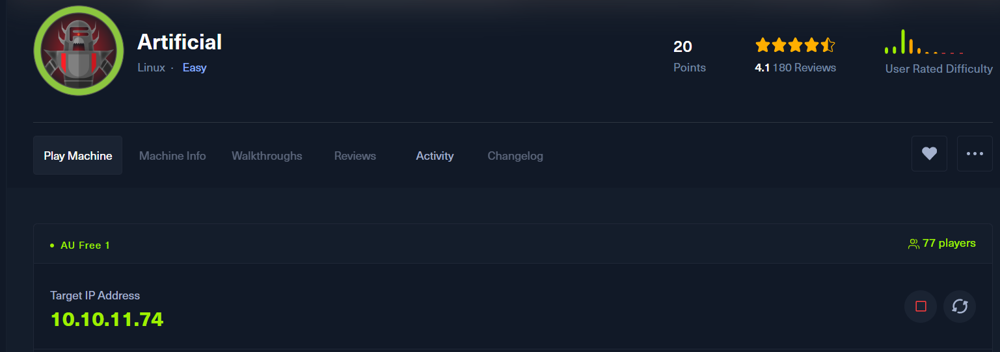
</p>

### Port Scan Results

<p align="center">
  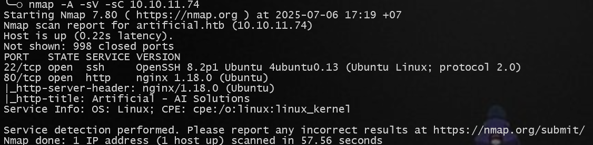
</p>

The target system exposes the following open ports and services:
```
PORT   STATE SERVICE VERSION
22/tcp open  ssh     OpenSSH 8.2p1 Ubuntu 4ubuntu0.13 (Ubuntu Linux; protocol 2.0)
80/tcp open  http    nginx 1.18.0 (Ubuntu)
|_http-server-header: nginx/1.18.0 (Ubuntu)
|_http-title: Artificial - AI Solutions
Service Info: OS: Linux; CPE: cpe:/o:linux:linux_kernel
```

### Initial Recon
Result from browser

<p align="center">
  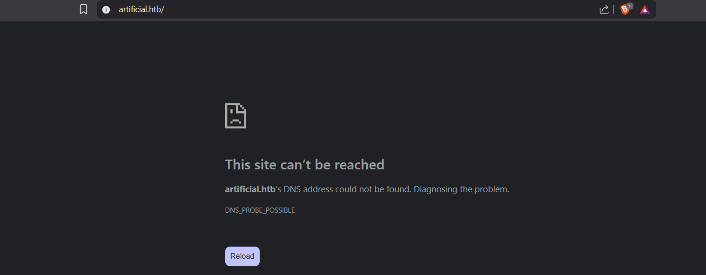
</p>

&rarr; Add the following entry to your hosts file ```10.10.11.74 artificial.htb```

After reviewing artificial.htb, I found several interactive features available:
- Account registration and login
- Uploading and executing machine learning models
- A downloadable [template.py](code/template.py) for building models in .h5 (Keras) format

<p align="center">
  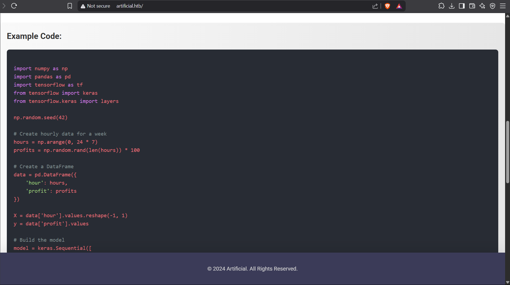
</p>

<p align="center">
  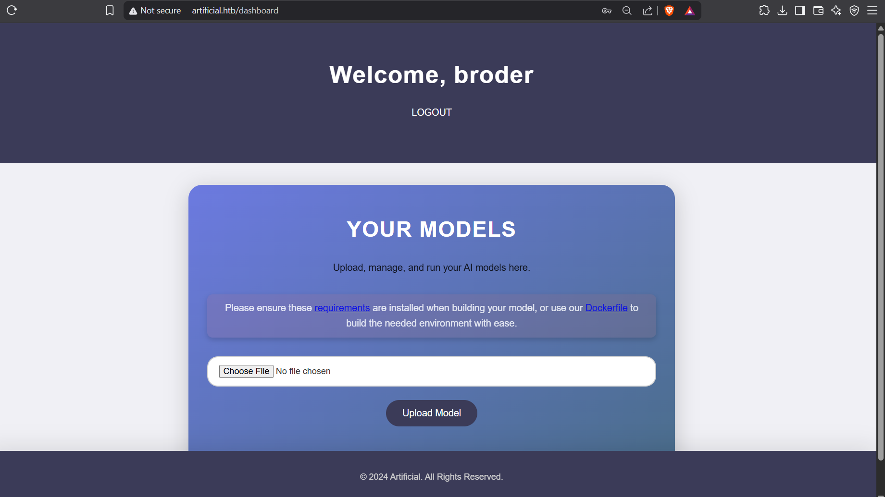
</p>

Upload model
<p align="center">
  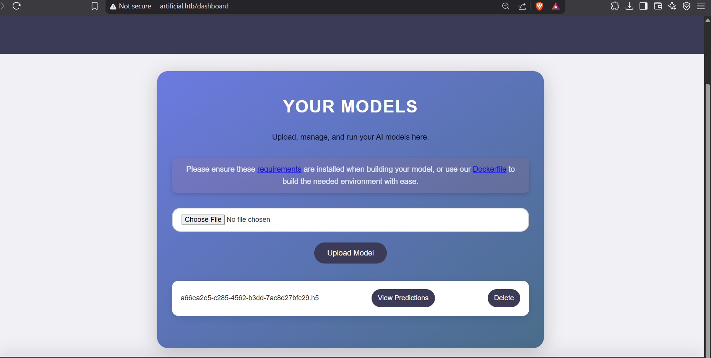
</p>

Run model
<p align="center">
  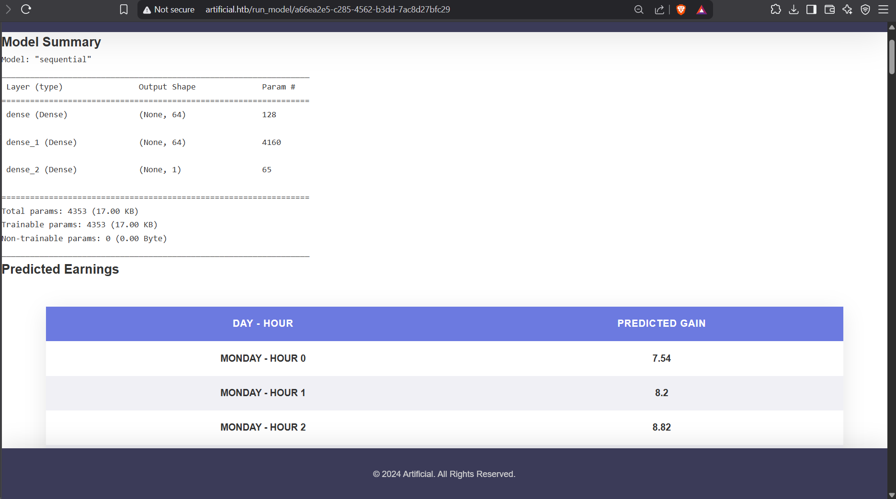
</p>

***The most significant risk lies in the server’s ability to execute user-uploaded machine learning models. It's unclear whether any validation or filtering is performed before these models are run. This behavior presents a promising attack surface and is worth investigating for potential vulnerabilities.***

## Exploiting Model Execution
### Research 
After a bit of Googling, I found several resources suggesting that this functionality could be exploitable.

<p align="center">
  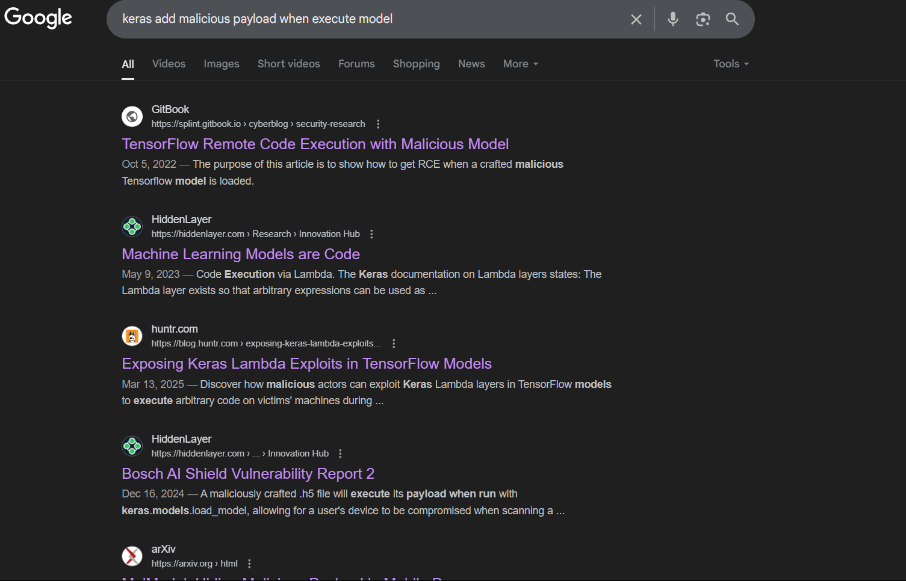
</p>

- [On Malicious Models](https://5stars217.github.io/2023-03-30-on-malicious-models/)
- [Potential Remote Code Execution (RCE) Vulnerability in Custom Layers Handling (#82214)](https://github.com/tensorflow/tensorflow/issues/82214)
### Prepare payload
I created two payloads: one to test command injection by triggering a sleep delay, and another to establish a reverse shell.
- [exp.py](code/exp.py)
- [run_model.py](code/run_model.py)

Reverse shell established successfully.

<p align="center">
  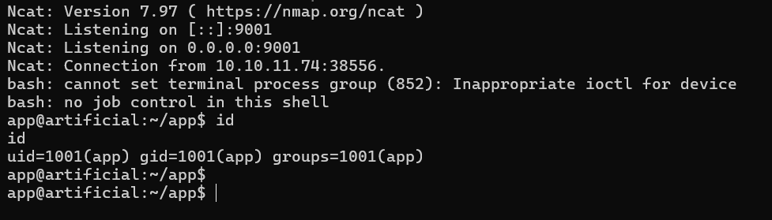
</p>

## User Account Owned

After gaining a shell as the app user, I accessed the server-side code to analyze it further and identify the underlying vulnerability.

Using [server_upload.py](code/server_upload.py) to receive data [app.tar.gz](code/uploads/app.tar.gz).

<p align="center">
  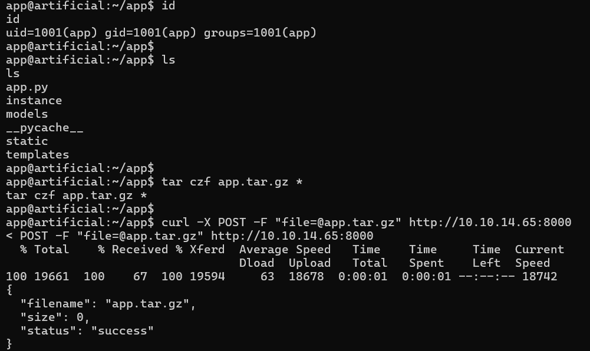
</p>

<p align="center">
  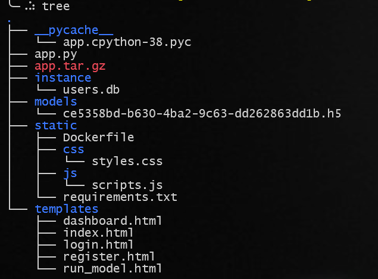
</p>

- Spotted user.db — looks like it holds the keys to user accounts on the site.

<p align="center">
  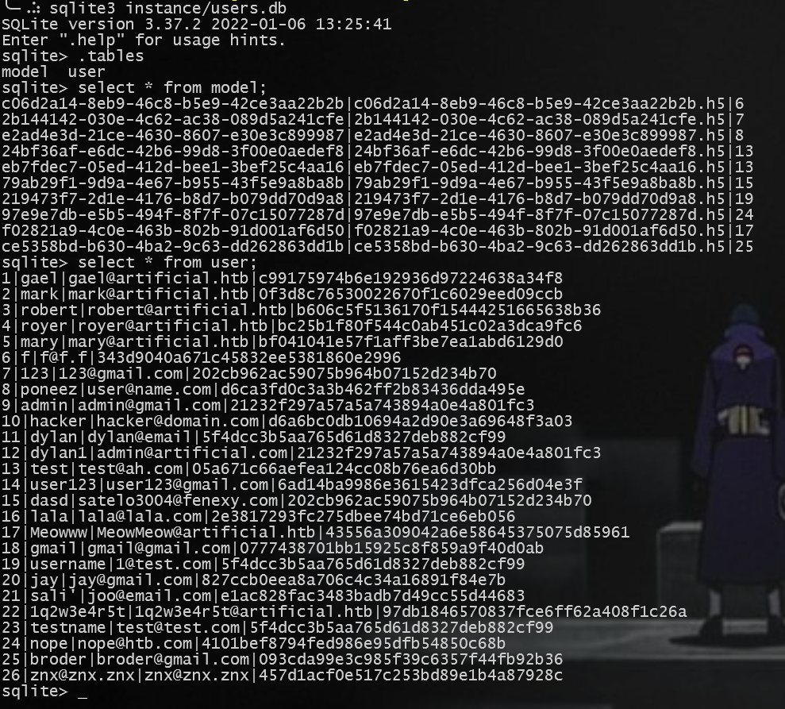
</p>

```
1|gael|gael@artificial.htb|c99175974b6e192936d97224638a34f8
2|mark|mark@artificial.htb|0f3d8c76530022670f1c6029eed09ccb
3|robert|robert@artificial.htb|b606c5f5136170f15444251665638b36
4|royer|royer@artificial.htb|bc25b1f80f544c0ab451c02a3dca9fc6
5|mary|mary@artificial.htb|bf041041e57f1aff3be7ea1abd6129d0
```
These are the first five accounts in the user table, all using the ***@artificial.htb*** domain. This suggests they belong to staff members or users associated with the organization or internal system.

### Smashing the Hash
<p align="center">
  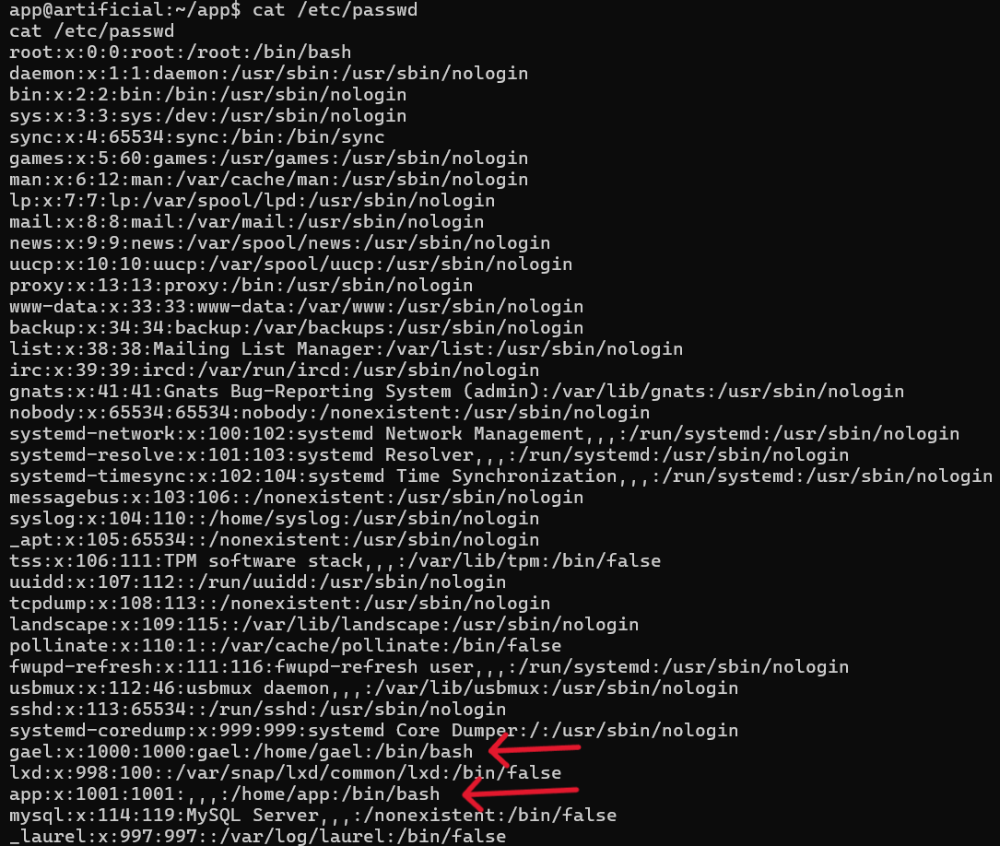
</p>

&rarr; ***The gael account stands out as noteworthy.***

<p align="center">
  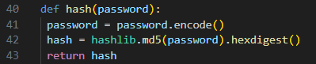
</p>

They're using MD5 for password hashing — perfect target for [John the Ripper](https://github.com/openwall/john).

<p align="center">
  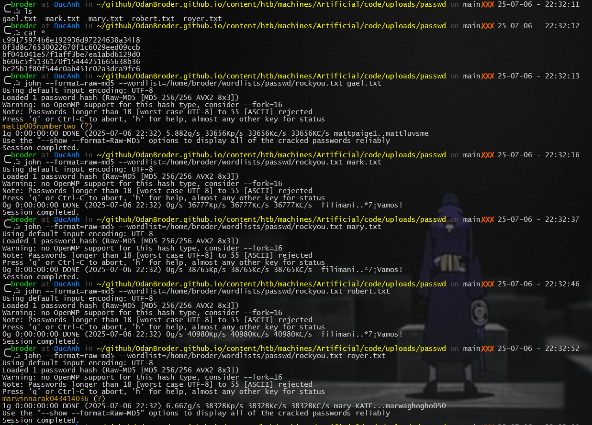
</p>

```
gael@artificial.htb: mattp005numbertwo
royer@artificial.htb: marwinnarak043414036
```

***Cracked and logged in — both gael and royer accounts are now accessible.***
<p align="center">
  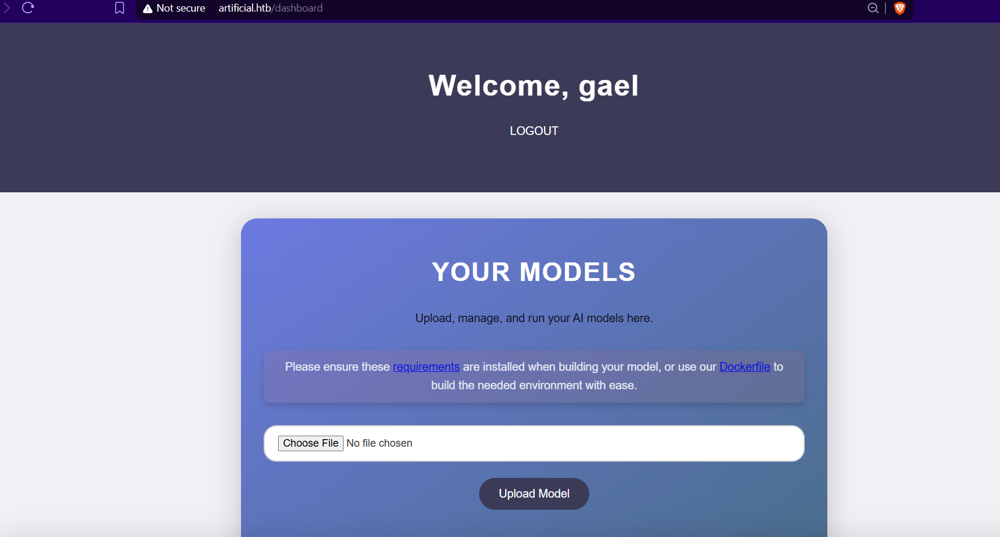
</p>

<p align="center">
  
</p>

### Escalating Account Compromise
Is there a way to escalate further and gain access to other users?

In ***app.py***, I discovered the secret_key, which allows me to forge valid session cookies. Using [hijacking_session.py](code/hijacking_session.py) , I can hijack sessions and log in as other users.

<p align="center">
  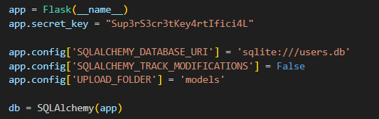
</p>

```mark@artificial.htb```
<p align="center">
  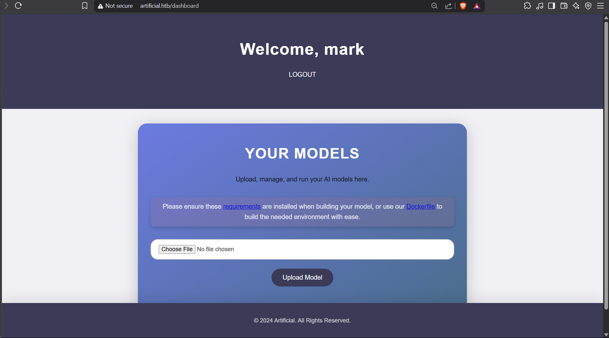
</p>

...or hijack sessions of other players active on the box.

```MeowMeow@artificial.htb```
<p align="center">
  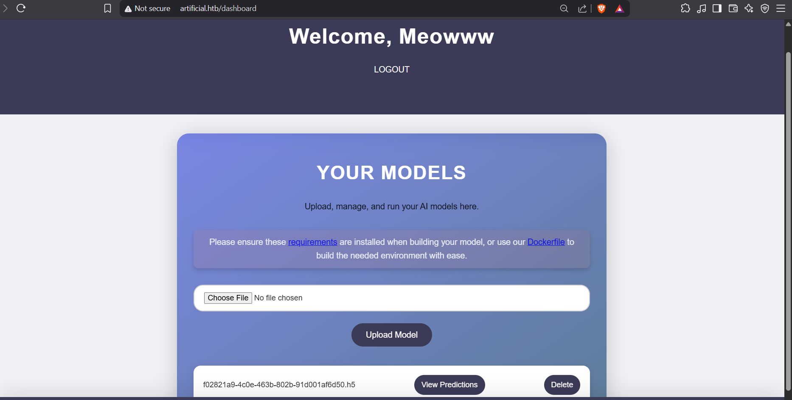
</p>

### Mission Complete: Flag Acquired

At first, I tried switching to the gael user using the cracked password, but it failed. This left me confused, and I spent a significant amount of time exploring alternative exploitation paths — but nothing seemed to work...

<p align="center">
  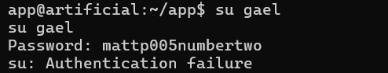
</p>

Wasted half a day chasing dead ends… then I tried SSH — and boom, I was in.

<p align="center">
  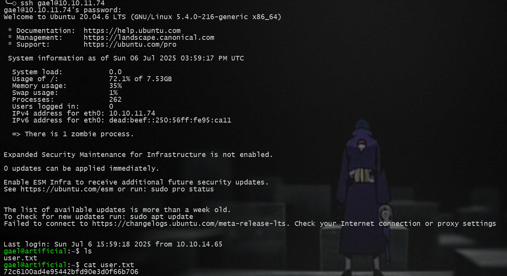
</p>

```
Flag: 72c6100ad4e95442bfd90e3d0f66b706
```

## System Pwned

Knowing the system runs Linux, I used ***linpeas.sh*** from [PEASS-ng](https://github.com/peass-ng/PEASS-ng/releases/tag/20250701-bdcab634) to enumerate potential privilege escalation vectors.

Fired up a server on my end and fetched ```linpeas.sh``` to the target — time to hunt for root.

```
python -m http.server 8000
```
<p align="center">
  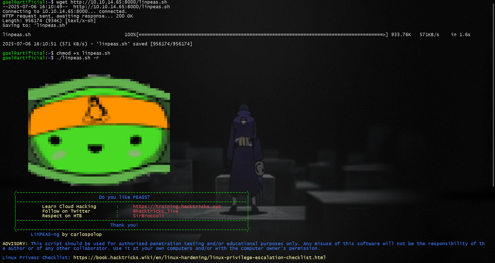
</p>

After running it, the ```linpeas.sh``` [output](code/linpeas_result.txt) revealed several noteworthy findings worth investigating.

<p align="center">
  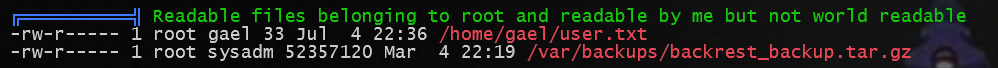
</p>

<p align="center">
  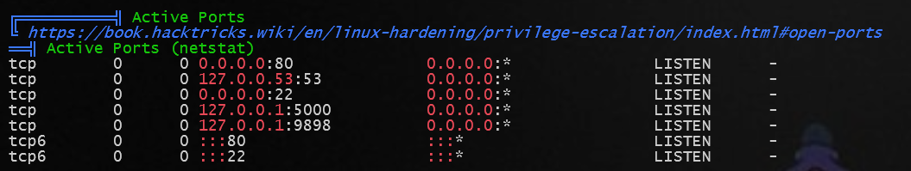
</p>

<p align="center">
  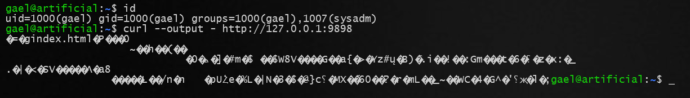
</p>

### Service Discovery

[backrest_backup.tar.gz](code/uploads/backrest_backup.tar.gz)

The ***backrest.log*** file also revealed that a web server is running locally on ```127.0.0.1:9898```

<p align="center">
  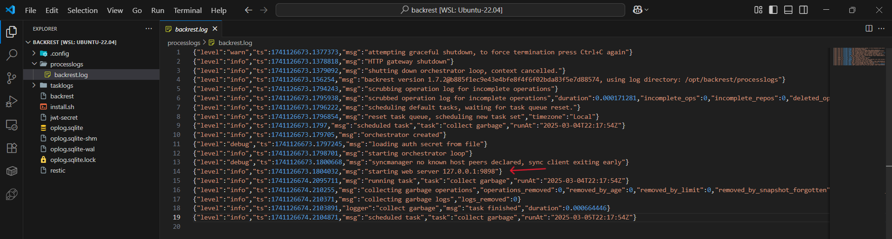
</p>

Setting up an SSH local port forwarding tunnel to view this service.

```
ssh gael@10.10.11.74 -L 9898:127.0.0.1:9898
```
[***Backrest***](https://github.com/garethgeorge/backrest)
<p align="center">
  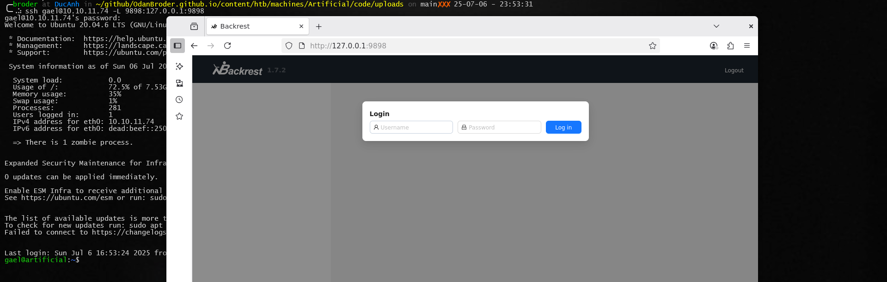
</p>

### Service Breach

<p align="center">
  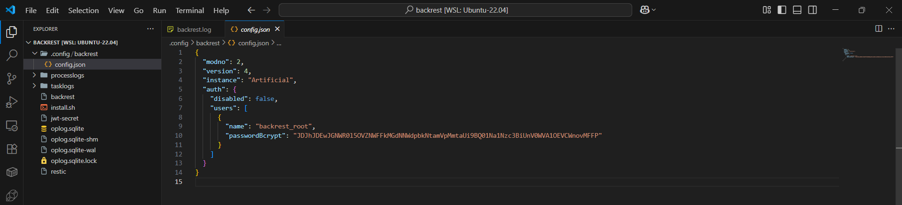
</p>

This is a base64-encoded bcrypt password. I’m also using John the Ripper to attempt to crack it.

<p align="center">
  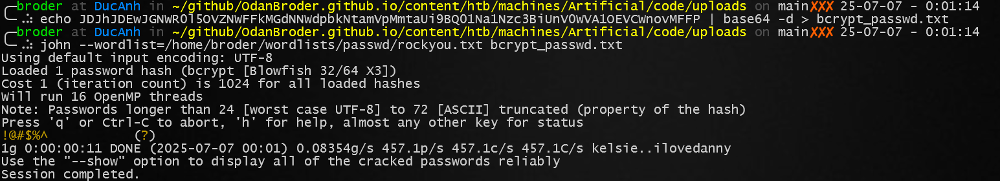
</p>

```
backrest_root: !@#$%^
```

### Escalate Privileges to Root

#### Backrest && Restic
<p align="center">
  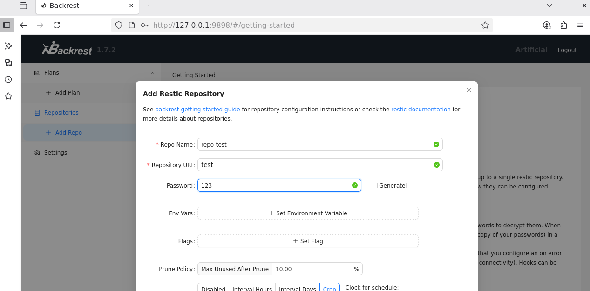
</p>

First, I explored some of the available actions, such as creating a repository and testing the "run command" feature. I attempted command injection, but it didn’t work.

<p align="center">
  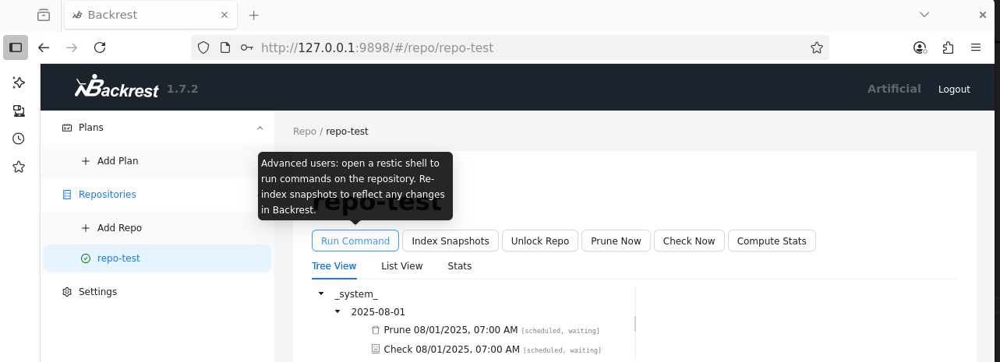
</p>

<p align="center">
  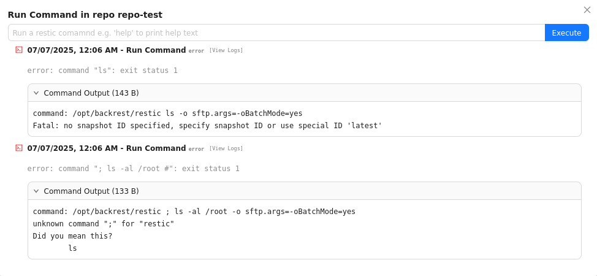
</p>

So, I needed to understand what Backrest actually does in order to find a way to leverage it for exploitation.

<p align="center">
  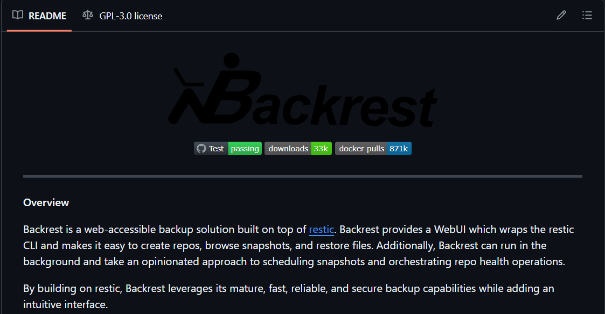
</p>

[restic](https://restic.net/)

<p align="center">
  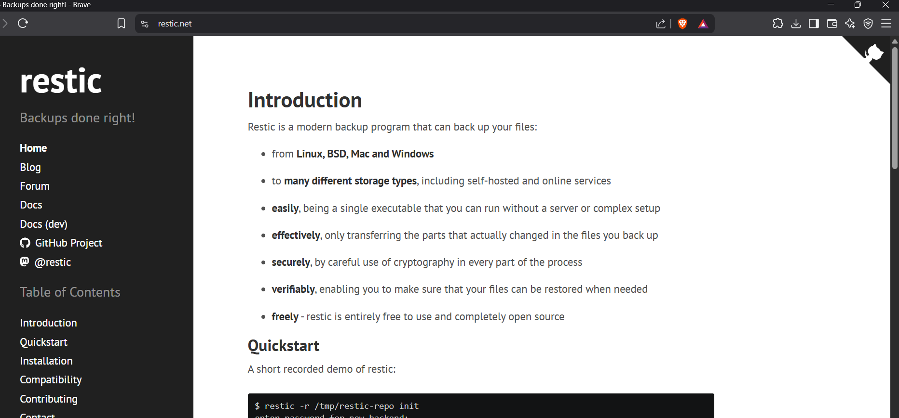
</p>

[Backrest: a cross platform backup orchestrator and WebUI for restic](https://forum.restic.net/t/backrest-a-cross-platform-backup-orchestrator-and-webui-for-restic/7069/1)

Imagine setting up a repo that points to ```/root``` and exfiltrates the data straight to my Restic server — now that’s leverage.

#### Weaponized Restic Server

[restic](https://gtfobins.github.io/gtfobins/restic/)

[rest-server](https://github.com/restic/rest-server/)

First, create a rest-server.
<p align="center">
  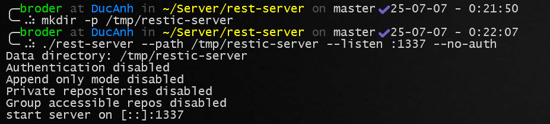
</p>

Init repo to my server.
<p align="center">
  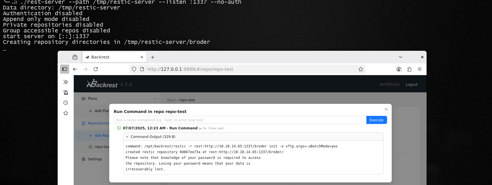
</p>

Backup ```/root``` directory to my repo 
<p align="center">
  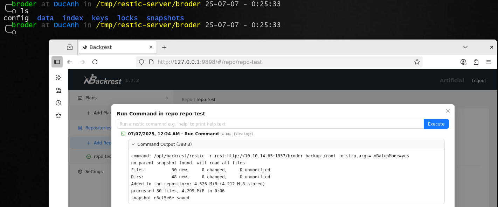
</p>

Access to ```/root``` from server.
<p align="center">
  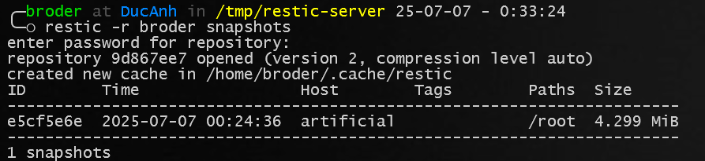
</p>

<p align="center">
  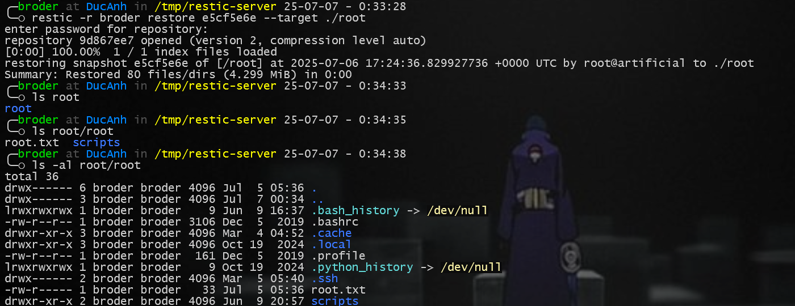
</p>

SSH access using the ```.ssh/id_rsa```
<p align="center">
  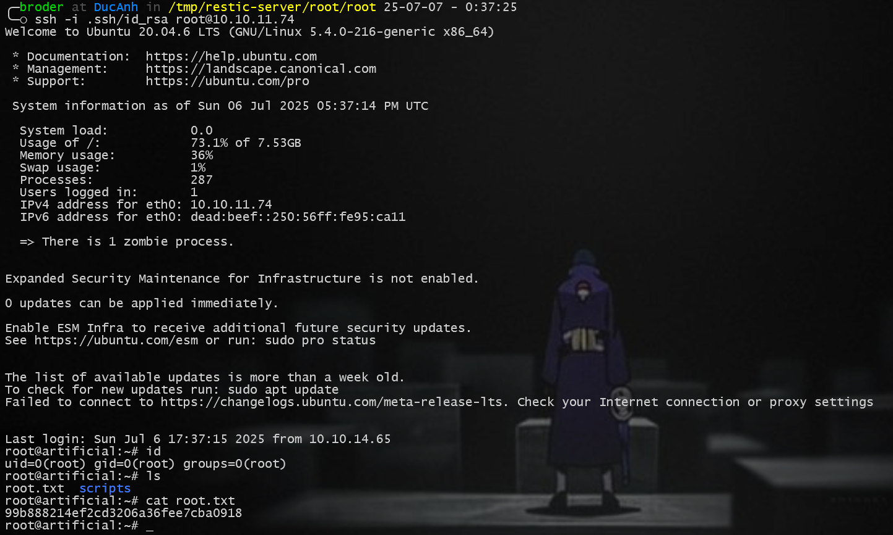
</p>

```
Flag: 99b888214ef2cd3206a36fee7cba0918
```