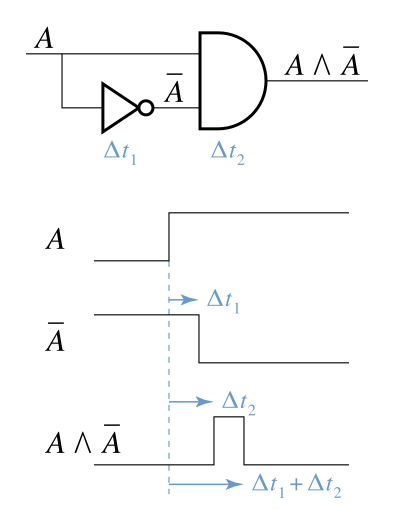
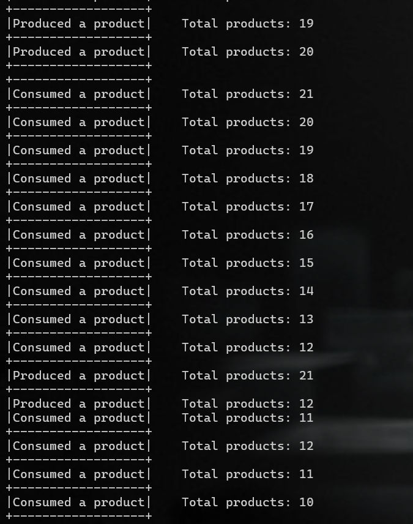
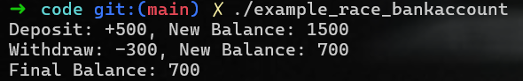

## Introduction

Race conditions are a common yet critical issue in both **digital systems** and **cybersecurity**, where improper handling of simultaneous operations can cause unpredictable behavior. Whether in **logic circuits** or **software applications**, race conditions can lead to unexpected glitches, security vulnerabilities, and even full system compromises.

### **Race Conditions in Reality**

Imagine two people trying to withdraw money from the same bank account at the exact same time. If the system doesn't handle both requests properly, it might allow them to overdraw the account — resulting in unexpected or incorrect behavior. This scenario perfectly illustrates the essence of a **race condition**: when the outcome depends on the timing of events.

In the world of cybersecurity, race conditions have been at the heart of some of the most infamous vulnerabilities, such as the [**Dirty COW exploit (CVE-2016-5195)**](https://dirtycow.ninja/). These types of bugs allow attackers to manipulate a system by taking advantage of timing issues in how resources are accessed.


### **Why Should You Care?**
Race conditions aren't just an abstract concept in digital circuits or operating systems — they are a real-world problem that attackers can exploit to:

- **Bypass security controls**
- **Gain unauthorized access**
- **Corrupt or modify data**

Understanding how race conditions occur, both in hardware and software, is essential for anyone working in **system design**, **security analysis**, or **exploit development**.


## What is a Race Condition?

A race condition happens when two or more entities simultaneously access, modify, or interact with a shared resource. The outcome depends on the order and timing of these interactions. Because the entities operate independently, their actions can overlap, leading to unexpected results or conflicts. This unpredictability can disrupt processes that rely on consistent or coordinated use of the shared resource.

### Race Condition in Logic Circuits

The race condition was first observed in logic circuits, where differences in propagation delays between circuit components can cause unintended glitches or incorrect outputs.


A **race condition** in a logic circuit occurs when the output depends on the timing of input signal changes, leading to unintended behavior or glitches. This happens due to differences in **propagation delays** of the logic gates involved.

<p align="center">
  

  *The term race condition was already in use by 1954, for example in David A. Huffman's doctoral thesis "The synthesis of sequential switching circuits".*
</p>


- The circuit has one input signal: **A**.
- It consists of:
  - A **NOT gate** with a propagation delay of **Δt₁**.
  - An **AND gate** with a propagation delay of **Δt₂**.

Propagation delay refers to the time it takes for a signal to travel through a logic gate from input to output.

- **NOT gate delay (Δt₁)**:  
  When the input **A** is fed into the NOT gate, it takes **Δt₁** units of time for the NOT gate to produce the correct output.

- **AND gate delay (Δt₂)**:  
  When the input signals arrive at the AND gate, it takes **Δt₂** units of time for the gate to produce the correct output.

Let's assume the input **A** changes from **low (0)** to **high (1)**. The race condition occurs due to the following timing differences:
  
- The NOT gate inverts the input A with a propagation delay of Δt₁. The AND gate then combines the original input A with the inverted value A' from the NOT gate. However, due to the delay in the NOT gate, A' reaches the AND gate later than A, creating a timing mismatch. The AND gate also introduces its own delay of Δt₂, further contributing to the glitch that causes the race condition.

When the input **A** changes from 0 to 1:

1. The AND gate receives the original input **A** immediately.
2. The NOT gate takes **Δt₁** time to update its output.
3. The AND gate will output a **short spike** because it initially receives the old value from the NOT gate before the NOT gate's output stabilizes.

The duration of this spike is:
```
(Δt₁ + Δt₂) - Δt₂ = Δt₁
```

**Note**
- The sum of Δt₁ and Δt₂ represents the critical path — the longest path that a signal must travel through the circuit, determining the circuit's overall delay.


### Race Condition in Software

When I research Race Conditon, I wonder why race conditions in software are often detected later than hardware race conditions, even though both deal with concurrency issues.

There are a few primary keys involved

**Timing Sensitivity: Hardware Requires Precise Timing Detection**. 
- In hardware, timing is critical because circuits rely on exact timing of signals to function correctly. Even a tiny delay in signal propagation can cause a critical failure, such as setup/hold time violations or metastability in flip-flops. 
  - Since hardware is physically built and operates in real-time, race conditions must be detected early during the circuit design phase. 
  - If a race condition in hardware goes undetected, it can cause permanent physical failures in chips, making the hardware unusable
 
&rarr; Hardware race condition detection happens early because it's mission-critical to ensure circuits work reliably before they are manufactured.

**Software Race Conditions Depend on Runtime Behavior**. 
- In contrast, software race conditions are logical bugs that emerge based on runtime behavior, meaning they depend on how the program runs in a particular environment. 
  - **Concurrency isn't always deterministic:** Software race conditions depend on the operating system's thread scheduling and hardware execution timing, which vary across different runs.
  - **They don't always manifest:** Some race conditions might only occur under specific conditions (e.g., heavy system load or specific input sequences), making them hard to detect during development.
  - **Testing tools aren't perfect:** Detecting software race conditions requires tools like ThreadSanitizer, Valgrind, or dynamic analysis tools, but these tools can slow down the program significantly, making it impractical to use them all the time.
  
&rarr; Software race conditions may only be discovered later during testing or even after deployment, when they manifest in real-world use cases.

#### Race Conditions

A **race condition** occurs in software when multiple code paths are executed concurrently, and the outcome depends on the timing of these operations. If the execution times of these paths vary unexpectedly, they may complete in an unintended order, leading to **unanticipated behavior** and **software bugs**. In some cases, race conditions can also arise between two or more separate programs, potentially resulting in **security vulnerabilities**.


#### How Race Conditions Happen

Race conditions typically occur in scenarios involving **concurrent processes** or **multithreading**. For example, when two threads attempt to access shared resources (such as files, memory, or hardware) simultaneously, without proper synchronization mechanisms, one thread might override or conflict with the other. This can lead to inconsistent data, crashes, or even security breaches.


#### Security Risks

Race conditions pose significant **security risks**, as attackers can exploit these timing issues to manipulate a program's execution. Some common attack vectors include:

- **Privilege Escalation**: Exploiting timing vulnerabilities to gain unauthorized access or escalate user privileges.
- **Data Corruption**: Modifying or deleting critical data by manipulating the execution order of operations.
- **Denial of Service (DoS)**: Triggering unexpected behaviors that cause the system to crash or hang, disrupting normal operation.


## Practical Example

### ***Producer-Consumer***

#### Problem
This [code](code/example_race.c) demonstrates a **race condition** between two threads: a producer and a consumer. Both threads share a common resource, `products`, which is a variable that tracks the total number of produced and consumed products. The producer thread increments the `products` variable, and the consumer thread decrements it. Without proper synchronization, this code exhibits undefined behavior, leading to potential issues such as negative values for `products`.

```c
int products = 0;

void *producer(void *arg)
{
    while (products < 100)
    {
        products++;
        printf("+------------------+\n");
        printf("|Produced a product|\tTotal products: %d\n", products);
    }
    return NULL;
}

void *consumer(void *arg)
{
    while (products > 0)
    {
        products--;
        printf("+------------------+\n");
        printf("|Consumed a product|\tTotal products: %d\n", products);
    }
    return NULL;
}
```

The main issue lies in the concurrent access to the shared resource `products` by both threads. Since the increment (`products++`) and decrement (`products--`) operations are not atomic, the threads can interfere with each other, causing incorrect results.

For example:
1. The producer thread reads the value of `products`.
2. The consumer thread also reads the value of `products` (which has not been updated by the producer yet).
3. Both threads perform their operations (increment and decrement), leading to an incorrect final value of `products`, which can become a false update.

In this code, I visualize the process of producing and consuming a product, where `products` is the shared variable of both threads. When I run this code, the value of `products` might be a false update.

<p align="center">
  
  One output sample
</p>

#### Solution

To fix the race condition, we use **mutexes** to synchronize access to the shared resource. This ensures that only one thread at a time can access and modify the `products` variable, making the program's behavior predictable and correct.

#### Key Changes
1. **Mutex Locking**: We use `pthread_mutex_lock` before accessing `products` to ensure mutual exclusion, preventing both threads from modifying the variable simultaneously.
2. **Mutex Unlocking**: After a thread has finished modifying the variable, it releases the lock with `pthread_mutex_unlock`, allowing the other thread to access the shared resource.

[code](code/example_race_fix.c)

```c
void *producer(void *arg)
{
    while (products < 100)
    {
        pthread_mutex_lock(&lock);  
        products++;                
        printf("+------------------+\n");
        printf("|Produced a product|\tTotal products: %d\n", products);
        pthread_mutex_unlock(&lock); 
    }
    return NULL;
}

void *consumer(void *arg)
{
    while (products > 0)
    {
        pthread_mutex_lock(&lock); 
        products--;                 
        printf("+------------------+\n");
        printf("|Consumed a product|\tTotal products: %d\n", products);
        pthread_mutex_unlock(&lock);
    }
    return NULL;
}
```
### ***Bank account***

***Note***

In a multi-threaded program, the operating system's scheduler decides when to switch between threads (called a context switch). However, context switches don't always happen exactly where we want during testing, making it hard to reproduce race conditions.

By inserting a small delay using `usleep(1)`. This increase the likelihood that the operating system will perform a context switch at that point and Force both threads to access shared resources at overlapping times, increasing the chances of a race condition.

#### Problem
Without the delay, the program might run so fast that both operations complete before a context switch happens, making the race condition harder to observe.

In this [code](code/example_race_bankaccount.c), two threads perform deposit and withdrawal operations on a shared bank account balance. Due to the lack of proper synchronization, a race condition occurs, causing incorrect balance updates.

```c
int balance = 1000;  
int depositAmount = 500;
int withdrawAmount = 300;

void* deposit(void* arg) {
    int amount = *(int*)arg;
    int temp = balance;
    usleep(1);  
    balance = temp + amount;
    printf("Deposit: +%d, New Balance: %d\n", amount, balance);
    return NULL;
}

void* withdraw(void* arg) {
    int amount = *(int*)arg;
    if (balance >= amount) {
        int temp = balance;
        usleep(1);  
        balance = temp - amount;
        printf("Withdraw: -%d, New Balance: %d\n", amount, balance);
    } else {
        printf("Withdraw: -%d, Insufficient funds! Current Balance: %d\n", amount, balance);
    }
    return NULL;
}
```

The race condition occurs because two threads simultaneously access and update a shared bank account balance without synchronization. In this example, the deposit thread reads the balance as 1000 and calculates a new balance of 1500 after adding 500. Meanwhile, the withdrawal thread also reads the balance as 1000 and calculates a new balance of 700 after subtracting 300. Since both threads perform their operations based on the initial balance of 1000, the withdrawal thread overwrites the deposit result. This leads to an incorrect final balance of 700 instead of the expected 1200, demonstrating how concurrent access to shared data can cause inconsistent results.

The root cause of the issue is that both threads read outdated values of the shared balance variable before any updates occur. As a result, each thread performs calculations using incorrect data and then writes its result, overwriting the other thread's update. 

For example:  
1. The deposit thread reads the balance as `1000`.  
2. The withdrawal thread also reads the balance as `1000`, before the deposit thread has updated it.  
3. The deposit thread calculates the new balance as `1500` (by adding `500`) and updates the balance.  
4. The withdrawal thread calculates the new balance as `700` (by subtracting `300`) and overwrites the deposit thread’s result.  

In this code, the shared variable `balance` is accessed and modified by both threads without synchronization, causing a race condition. When I run this code, the final balance may be incorrect due to simultaneous operations, as the withdrawal thread can overwrite the deposit thread’s update.

<p align="center">
  
  One output sample
</p>

#### Solution  

To fix the race condition in the bank account example, we use **mutexes** to synchronize access to the shared `balance` variable. This ensures that only one thread at a time can read or update the balance, preventing inconsistent results caused by simultaneous operations. By locking the critical section where the balance is accessed, the program's behavior becomes predictable and correct.

#### Key Changes  
1. **Mutex Locking**: We use `pthread_mutex_lock` before reading or modifying the `balance` variable to ensure mutual exclusion, preventing both the deposit and withdrawal threads from accessing the variable at the same time.  
2. **Mutex Unlocking**: After a thread completes its operation on the `balance` variable, it releases the lock using `pthread_mutex_unlock`, allowing the other thread to safely access the shared resource.  
3. **Critical Section**: The balance update logic is enclosed within the locked section to ensure that all read-modify-write operations are atomic and cannot be interrupted by another thread.

```c
pthread_mutex_t lock;
int balance = 1000;
int depositAmount = 500;
int withdrawAmount = 300;

void *deposit(void *arg)
{
    int amount = *(int *)arg;

    pthread_mutex_lock(&lock);
    int temp = balance;
    usleep(1);
    balance = temp + amount;
    printf("Deposit: +%d, New Balance: %d\n", amount, balance);
    pthread_mutex_unlock(&lock); 

    return NULL;
}


void *withdraw(void *arg)
{
    int amount = *(int *)arg;

    pthread_mutex_lock(&lock); 
    if (balance >= amount)
    {
        int temp = balance;
        usleep(1);
        balance = temp - amount;
        printf("Withdraw: -%d, New Balance: %d\n", amount, balance);
    }
    else
    {
        printf("Withdraw: -%d, Insufficient funds! Current Balance: %d\n", amount, balance);
    }
    pthread_mutex_unlock(&lock); 

    return NULL;
}
```

[code](code/example_race_bankaccount_fix.c)

## Race Conditions in Operating Systems

Race conditions in operating systems occur when multiple processes or threads compete to access shared resources without proper synchronization. These issues can lead to unexpected behaviors, system crashes, data corruption, and security vulnerabilities. Understanding race conditions is critical for operating system developers, cybersecurity professionals, and CTF participants who explore kernel-level challenges. 

### Common Scenarios
- **File Access**: Multiple processes accessing the same file simultaneously.
- **Resource Allocation**: Competing processes attempting to acquire system resources (e.g., memory, I/O devices).
- **Inter-process Communication (IPC)**: Race conditions in pipes, message queues, or shared memory.

### Real-World
Race conditions can have severe consequences, affecting system stability, security, and functionality. Here are some notable real-world examples:

1. **Data Corruption**: A race condition in a database system could corrupt critical data, leading to incorrect application behavior.
2. **System Crashes**: Operating systems can crash if kernel-level race conditions corrupt essential structures.
3. **Security Breaches**: Attackers can exploit race conditions to escalate privileges, bypass security checks, or inject malicious code.


#### Notable CVEs Related to Race Conditions
Race conditions are a common source of vulnerabilities in operating systems. Here are some notable CVEs:

1. **CVE-2016-5195 (Dirty COW)**
   - **Description**: A race condition in the Linux kernel's memory subsystem allowed attackers to gain write access to read-only files, leading to privilege escalation.
   - **Impact**: This vulnerability was widely exploited, affecting millions of Linux systems.
   - **Fix**: The issue was patched by implementing proper synchronization in the kernel's memory management.

2. **CVE-2021-3493**
   - **Description**: A race condition in the overlay filesystem in the Linux kernel allowed attackers to gain root privileges.
   - **Impact**: Exploited in the wild to gain unauthorized access.
   - **Fix**: The patch involved fixing the synchronization issue in the filesystem.

3. **CVE-2014-4014**
   - **Description**: A race condition in the handling of user credentials in FreeBSD allowed attackers to hijack sessions.
   - **Impact**: This vulnerability compromised the confidentiality and integrity of user sessions.
   - **Fix**: Proper locking mechanisms were introduced to address the race condition.

...

*Race conditions often appear in **Capture the Flag (CTF)** challenges, particularly in the **pwnable** category, where participants exploit kernel vulnerabilities to achieve privilege escalation.*


<!-- ## Tools for Detecting Race Conditions
Several tools can help identify and analyze race conditions in operating systems:

1. **ThreadSanitizer**: Detects race conditions at runtime.
2. **Valgrind**: A powerful tool for memory debugging and detecting concurrency issues.
3. **Syzkaller**: A kernel fuzzer that can uncover race conditions and other vulnerabilities in the Linux kernel. -->


## Mitigation Techniques

1. **Use Proper Synchronization Primitives**:
   - Mutexes
   - Semaphores
   - Spinlocks

2. **Minimize Critical Sections**:
   - Reduce the amount of code executed within critical sections to minimize contention.

3. **Implement Atomic Operations**:
   - Use atomic operations for shared resource access to ensure data consistency.


## Conclusion

Race conditions are a critical issue in multi-threaded and multi-process systems, where the timing or order of operations can lead to unpredictable results or security vulnerabilities. Preventing race conditions requires careful design and the use of appropriate synchronization techniques. Proper synchronization is crucial to maintaining data integrity and ensuring that multi-threaded or multi-process programs function as expected.

For further learning, it’s essential to study concurrency and synchronization mechanisms specific to your programming environment and continue exploring best practices to avoid race conditions in complex systems.


<!-- 
## Further Reading & References

[Race Condition - Wiki](https://en.wikipedia.org/wiki/Race_condition) 

[Race Condition - Lance Harvie - firmware](https://medium.com/@lanceharvieruntime/are-race-conditions-ruining-your-firmware-design-heres-how-to-fix-it-4d6d7b547ca)
-->