## Environment Setup

**Scope:** `192.168.50.0/24`

---

### 1. Domain Controller (DC)
- **Role:** Active Directory Domain Controller  
- **Domain:** `victim.org`  
- **IP Address:** `192.168.50.100`  

---

### 2. MACHINEA
- **Domain Membership:** `victim.org`  
- **IP Address:** `192.168.50.3`  
- **Users:**  
  - `SyJoon` &rarr; Local Administrator  
  - `VICTIM\machinea` &rarr; Standard Domain User  
- **Notes:** Default Windows security features/policies intact (no modifications).  

---

### 3. VICTIM1
- **Domain Membership:** `victim.org`  
- **IP Address:** `192.168.50.4`  
- **Users:**  
  - `victim1` &rarr; Local Administrator  
  - `VICTIM\machinea` &rarr; Local Administrator, member of group `Remote Management Users`
- **Configuration:**  
  - Inbound & outbound **File and Printer Sharing (SMB)** enabled  
  - **Windows Remote Management (HTTP-In)** enabled  
  - Default Windows security features/policies intact (no modifications).  

### 4. ATTACKER (Kali Machine)
- **IP Address:** `192.168.50.2` 

##  Scenario

- A domain user `VICTIM\machinea` on **MACHINEA** mistypes a hostname or is tricked into accessing a non-existent network resource (e.g., `\\fakehost\share`).  
- The attacker poisons **LLMNR** and **NBT-NS**, causing MACHINEA to authenticate to the attacker-controlled host.  
- This results in the capture of the user’s **NTLMv2 hash**.  
- The attacker then relays the captured credentials to **VICTIM1** (via SMB relay), gaining access and dumping the **SAM database**.  
- With the dumped hashes, the attacker can perform **offline password cracking** or use **Pass-the-Hash (PtH)** to authenticate directly to **VICTIM1**.  

    
    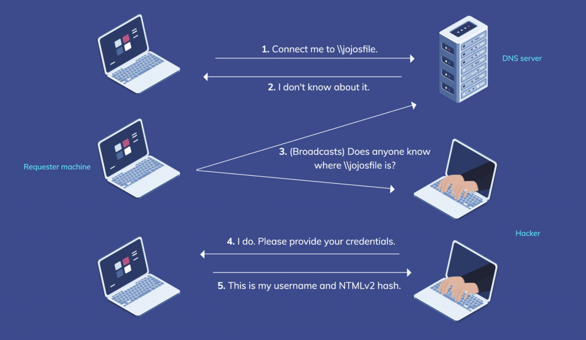

## Exploit chain

### Reconnaissance & Discovery

*Requirements: SMB signing disabled or have SMB signing enabled but not required*

    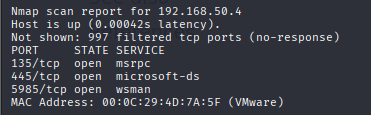
    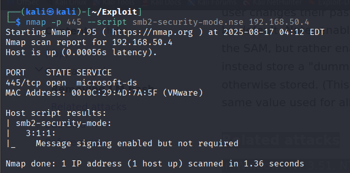
    <b>vulnerable</b>

### Initial Access
A user may accidentally mistype a hostname while trying to access a network resource.  
Alternatively, an attacker can stage a scenario — for example, impersonating a boss or department head and sending an email instructing an employee to connect to a shared resource “for review before the next meeting.”  

    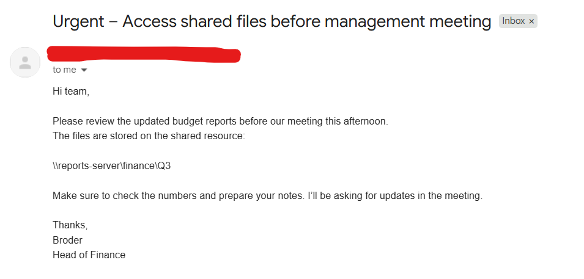

Both cases cause the victim system to attempt name resolution, opening the door for LLMNR/NBT-NS poisoning.  

### Credential Access

#### Attacker set up

    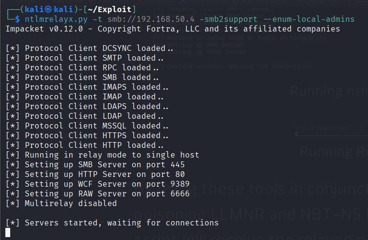
    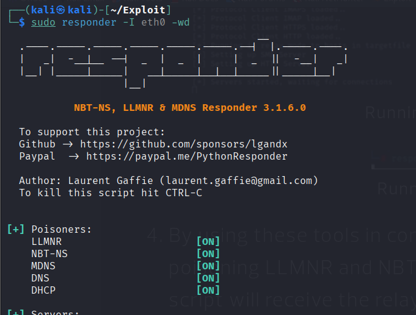

#### MACHINEA 
`VICTIM\machinea` read phising mail / mistype a hostname

    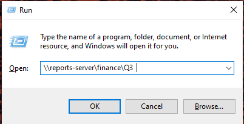
    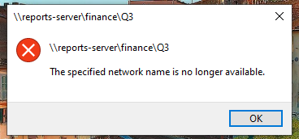

#### Obtaining User Hashes

    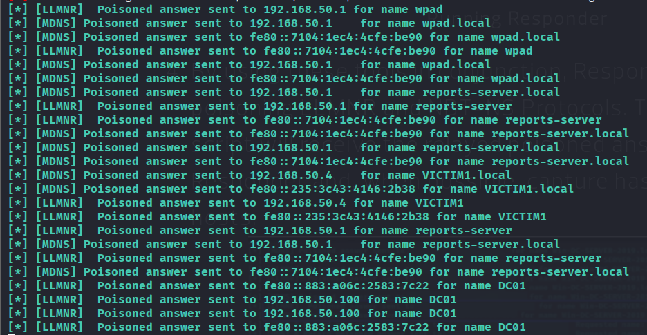
    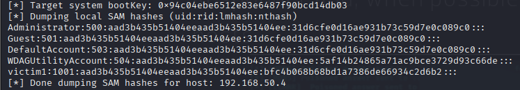

If the captured hash corresponds to a weak password that exists in my wordlist, I can recover the plaintext password using tools such as Hashcat.  

    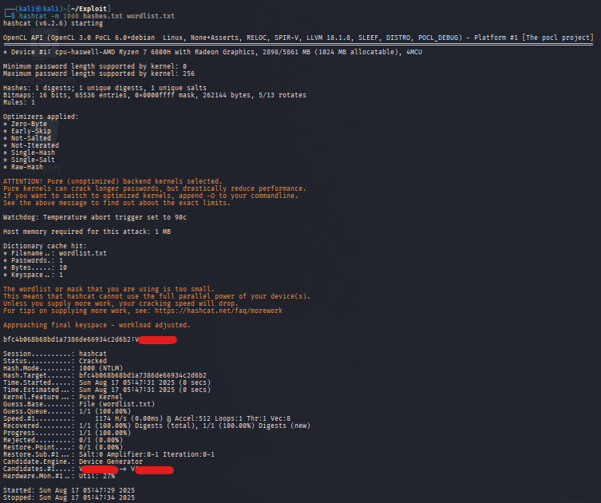

    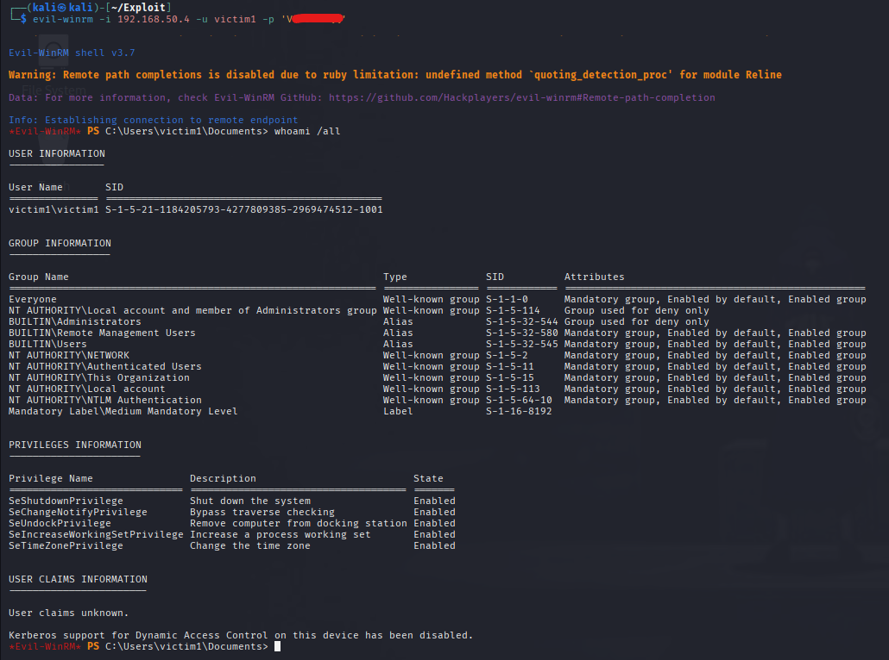
    password
    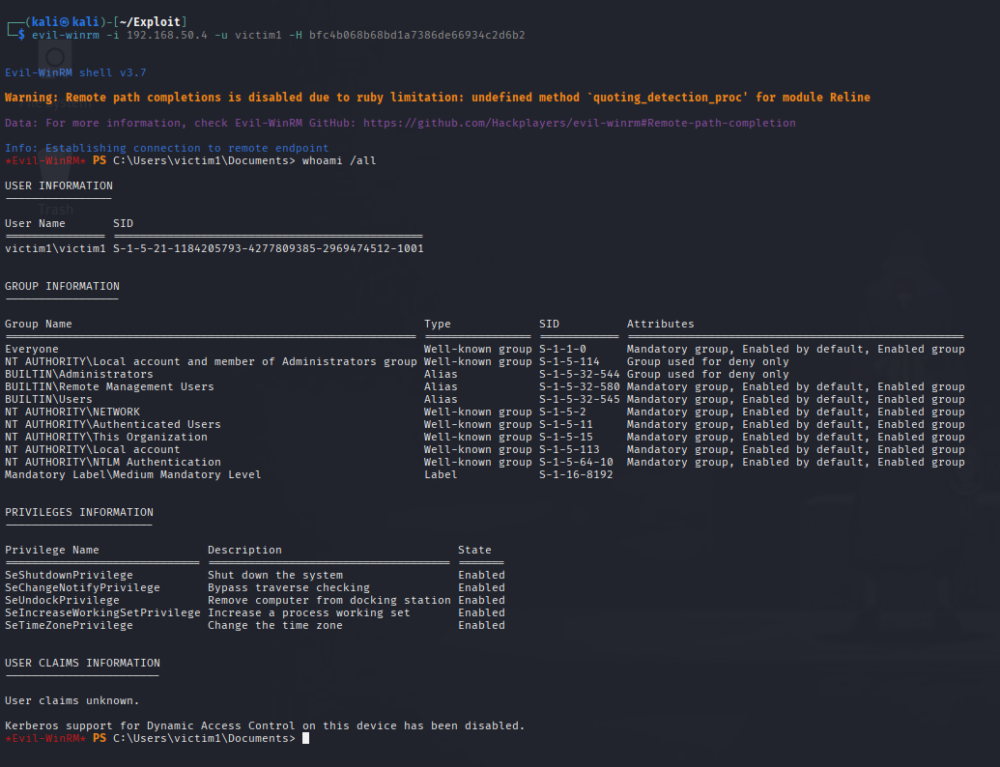
    pth

## Attack Rating
- **Technique:** Easy / Not sophisticated  
- **Requirements:**  
    - LLMNR and NBT-NS enabled on the target machine  
    - SMB accessible  
    - WinRM enabled (if planning remote login)  
    - Target user triggers a connection (e.g., mistyped hostname or network resource)  
    - Target user has Administrator privileges (for post-exploitation activities)  
- **Context:**  
    - Attack is feasible and can succeed reliably  
    - Can be performed stealthily without triggering antivirus alerts, though advanced system monitoring or intrusion detection may still detect the activity.
- **Real World:**  
    - This scenario is likely to occur in real environments.

[Beyond the Basics: Exploring Uncommon NTLM Relay Attack Techniques](https://www.guidepointsecurity.com/blog/beyond-the-basics-exploring-uncommon-ntlm-relay-attack-techniques/) introduces additional NTLM relay attack methods and variations beyond the standard scenarios.

## References

[The LLMNR/NBT-NS strike](https://blogs.manageengine.com/corporate/general/2020/07/16/the-llmnr-nbt-ns-strike.html)

[Beyond the Basics: Exploring Uncommon NTLM Relay Attack Techniques](https://www.guidepointsecurity.com/blog/beyond-the-basics-exploring-uncommon-ntlm-relay-attack-techniques/) introduces additional NTLM relay attack methods and variations beyond the standard scenarios.

[Back to Basics: LLMNR and NBT-NS Spoofing](https://warroom.rsmus.com/llmnr-and-nbt-ns-spoofing/)